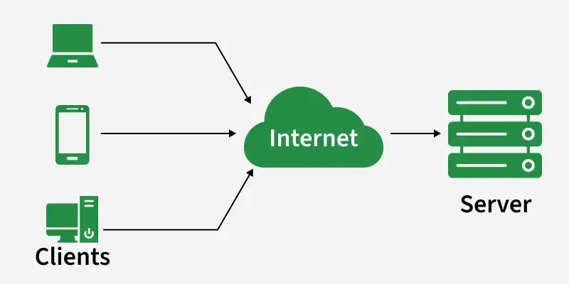
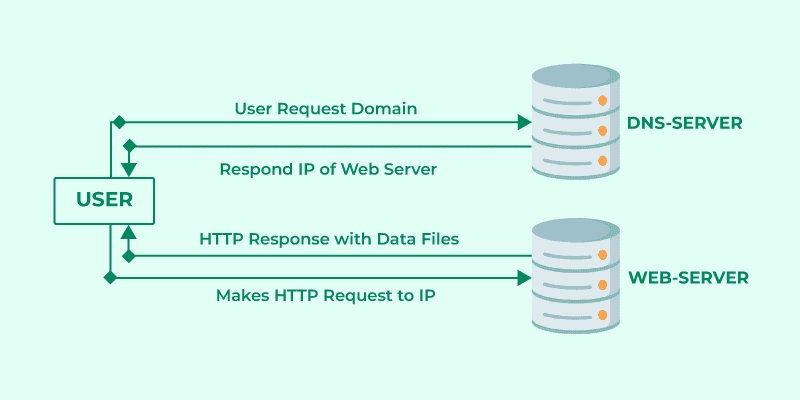
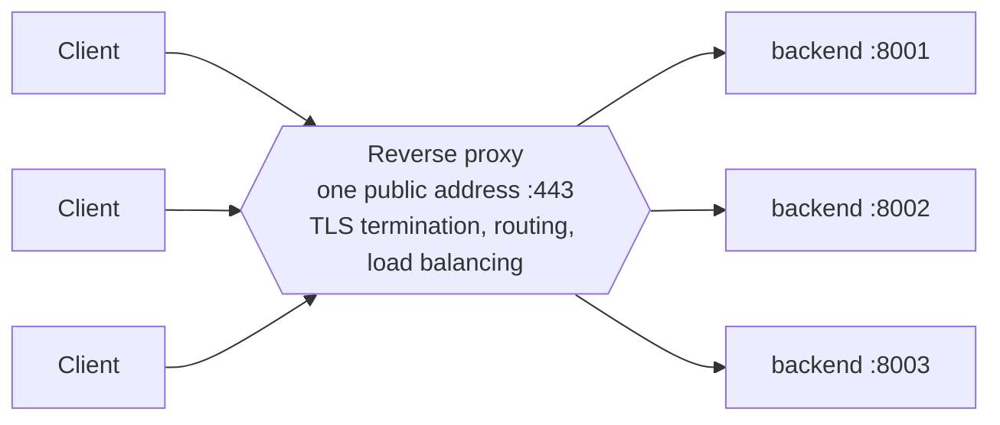
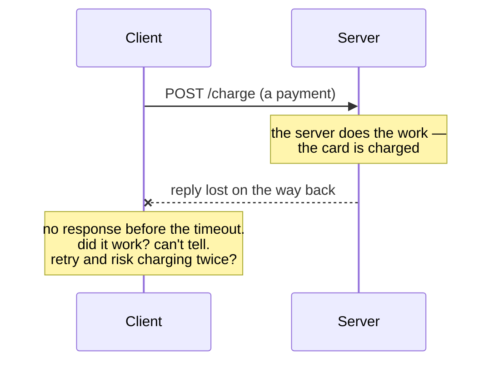
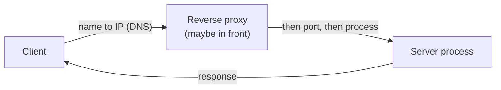

# Session 4: Networking — How Services Talk

**ITA Software Architecture 2026 Fall | 3 hours | Foundations block (hands-on)**

> Every architecture you'll read this semester is really *services talking over a network* — a browser to a server, a server to a database, one microservice to another. Today we open that up: what a **port** is, how a name becomes an address (**DNS**), how a request actually finds a server, what a **reverse proxy** does in front, and — the part that shapes every distributed design — **why the network is unreliable**. Keyboard-first; you'll watch real requests succeed and fail.

---

## Learning Goals

- Explain the **client–server model** and trace a request's round-trip: name → address → port → process → response.
- Understand **ports and listening processes**, and the difference between `localhost`, `0.0.0.0`, and a real address.
- Resolve names to addresses with **DNS**, and know why services address each other by *name*, not number.
- Explain what a **reverse proxy / load balancer** does and why architectures put one in front.
- Reason about **network failure** — latency, timeouts, connection-refused, partial failure — and why it makes distributed systems hard.

---

## Before Class

- Your **webtop Linux container** from Session 2 running, with a terminal open and your Git repo cloned inside it.
- That's it — we build on the `curl` you met in Session 3.

---

## Today's Teachings

### Part 0 — Warm-up (10 min)
Last week you ran `curl https://api.github.com/...` and got JSON back. Ask the room: *between pressing Enter and the reply arriving, what actually happened?* Collect guesses on the board. Today we fill in the blanks.

### Part 1 — The client–server model & a request's journey (30 min) — blackboard

**The shape.** A **client** wants something from a **server**; they exchange messages over a network.



Every client (a browser, a phone app, another service, `curl`) sends a **request** and gets a **response** back. "The Internet" in the middle stands for all the network hops the message actually crosses. That is the mental model for the rest of the semester: **an architecture is boxes (processes) connected by these request/response wires.**

**The journey.** How does one request actually get there and back? It can be modelled in these four steps:



A web server does not have a name, it has an **IP address**. The name is just a lookup key — easier for people to remember than an IP address.

1. **Name → address.** `api.github.com` isn't a place. The client asks a **DNS server**: *what's the IP for this name?*
2. The DNS server **replies with the IP address** of the machine you actually want.
3. **Address → port → process.** The client now makes its **HTTP request straight to that IP**, on a **port** (`:443` = HTTPS, `:80` = HTTP, `:22` = SSH). An IP reaches a *machine*; the port picks the *program* on it.
4. A program is **listening** on that port, handles the request, and the server **responds with the data** — back down the same connection.

### Part 2 — Ports & listening processes (35 min) — keyboard, the set-piece

> **Today's hands-on parts (2, 3, 5, 6) all run *inside the webtop container*, not on your laptop** — the same terminal you used in Sessions 2–3. `python3`, `ss`, `dig`, and `getent` are Linux tools that live in the container, and `localhost` here means *the container itself*, not your host machine. Mixing up the two machines is the easiest way to confuse yourself today — if a command behaves oddly, first check which machine your terminal is on.

Make a server appear and talk to it:

```bash
python3 -m http.server 8000        # this container is now a web server on port 8000
curl http://localhost:8000         # talk to it from inside the same container
ss -tlnp                           # what's listening, on which ports?
```

- **`ss` ("socket statistics") shows what the network stack is doing** — the modern replacement for `netstat`. The flags stack up: `-t` TCP only, `-l` only sockets in the *listening* state, `-n` numeric ports (don't translate `80` → `http`), `-p` show the process that owns each socket. So `ss -tlnp` reads as "which processes are listening on which TCP ports."
- **A port is a door a process listens on.** Only one process per port — try starting a second server on `8000` and read the *"address already in use"* error.
- **`localhost` vs `0.0.0.0` vs a real address:** `localhost` (127.0.0.1) is "only this machine"; `0.0.0.0` means "accept from anywhere." Start the server on each and see who can reach it.
- Kill it and watch `curl` fail — the door is closed now (foreshadows Part 6).

### Part 3 — Names: DNS (25 min) — keyboard
Where does `localhost` — or `api.github.com` — come from?

```bash
dig +short api.github.com          # the name resolves to one or more IPs
getent hosts localhost             # /etc/hosts maps names locally
```

- **`dig` ("domain information groper") queries DNS directly.** `dig api.github.com` asks a DNS resolver "what address(es) back this name?"; `+short` trims the reply to just the IPs (without it you get the full record — TTLs, record types, which server answered).
- **`getent hosts <name>` resolves a name the way a normal program does.** It walks the system's name-resolution order (`/etc/nsswitch.conf`): the local `/etc/hosts` file first, then DNS. That's why `getent hosts localhost` answers `127.0.0.1` straight from the file, with no DNS lookup.
- A **hostname** is a stable name; the **IP** behind it can change. That indirection is what lets you move or scale a service without callers changing their code.
- **Foreshadow Session 5:** `docker compose` gives each service a name, and containers reach each other *by that name* — this is why.

### Part 4 — Putting something in front: reverse proxy & load balancer (30 min) — blackboard + short demo
Real systems rarely expose the app directly. On the board:

- A **reverse proxy** is one public address that forwards requests to one or more backend processes.
- It's where you do **TLS termination** (HTTPS is decrypted here), routing, and **load balancing** — spreading traffic across several identical backends so one machine isn't a bottleneck or a single point of failure.
- One line of why it matters architecturally: it's a **boundary** — callers depend on the front address, not on how many services hide behind it (forward link to microservices, S19, and its gateway).



Optional demo: a tiny nginx (or `python` twice on two ports) with the proxy sending `/a` and `/b` to different backends.

### Part 5 — Remote machines, briefly (15 min) — keyboard
Reaching *another* machine is just the same round-trip to a different address. SSH is one such service (port 22): `ssh user@host` opens a shell on the far side; the terminal skills from S2 work identically there. We won't dwell — the point is that "remote" is not special, it's just a network hop.

### Part 6 — The network is unreliable (25 min) — blackboard + demo — the payoff
Everything above assumed the request arrives. It often doesn't:

```bash
curl --max-time 3 http://localhost:9999          # nothing listening → connection refused
curl --max-time 3 https://httpbin.org/delay/10   # too slow → timeout
```

- **Failure modes:** connection refused (no one home), timeout (too slow / lost), and the nasty one — **partial failure** (the request arrived and did its work, but the *reply* was lost, so the caller can't tell).



- **The punchline:** a network call is *not* a function call. This single fact drives retries, timeouts, idempotency, and every hard trade-off in the distributed half of this course. **Session 18 (events)** and **Session 19 (microservices)** are, in large part, about living with this.

### Part 7 — Wrap-up (10 min)
The cheat-sheet: name → address → port → process → response, with a proxy possibly in front, over a network that can drop any of it. Commit today's notes/commands.



Every arrow can be slow (**latency**), **refused** (nothing listening), or silently **dropped** (partial failure) — that's the whole distributed half of the course in one picture.

---

## Exercise (in class)

Using only the terminal, save your commands to `answers.sh` and push:

- Start a server (`python3 -m http.server`), find its port with `ss -tlnp`, and fetch it with `curl`.
- Resolve two public hostnames with `dig +short`; note that one has several IPs (that *is* load balancing).
- Show the difference between binding to `localhost` and `0.0.0.0` (which one can a second container reach?).
- Trigger **two** different network failures on purpose (a refused connection and a timeout) and record what `curl` reports for each.
- One sentence: *why can't the client tell a "lost reply" apart from a "server never did the work"?*
- **Commit and push** to your repo.

---

## After Class

- In two sentences: what does DNS give you that hard-coding an IP wouldn't, and what does a reverse proxy give you that exposing the app directly wouldn't?
- **Next week is Docker + the group assignment** — make sure Docker Desktop still runs on your laptop.

---

## Optional

- [optional] *Computer Networking: A Top-Down Approach* — Chapter 1 only, for the request-journey picture.
- [optional] Julia Evans' *How DNS works* zine and her *networking* comics — friendly and concrete.
- [optional] Cloudflare Learning: *What is a reverse proxy?* and *What is load balancing?* — two short, plain-language reads.
- [optional] *Fallacies of Distributed Computing* — the classic list; skim it and keep it in mind all semester.
