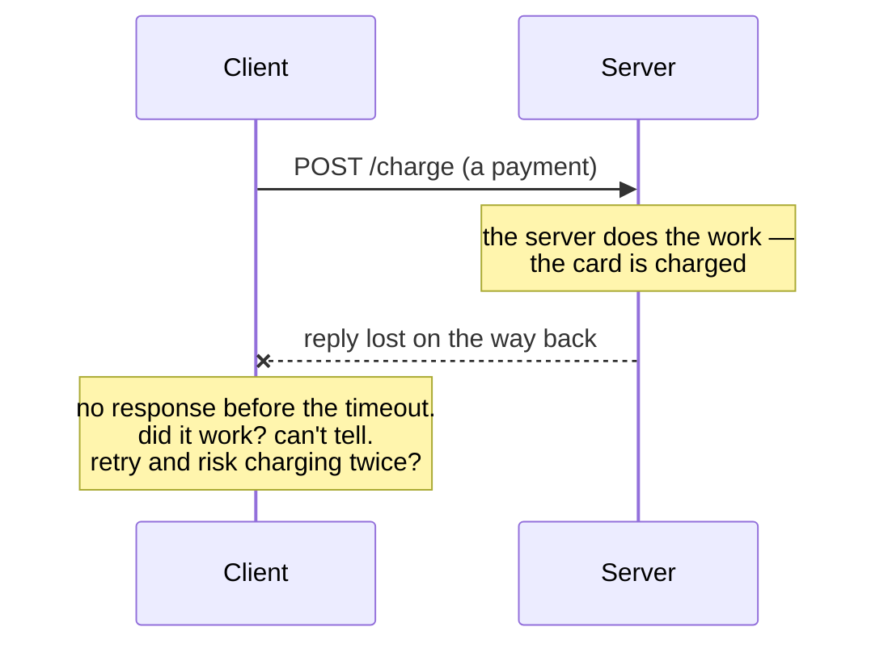
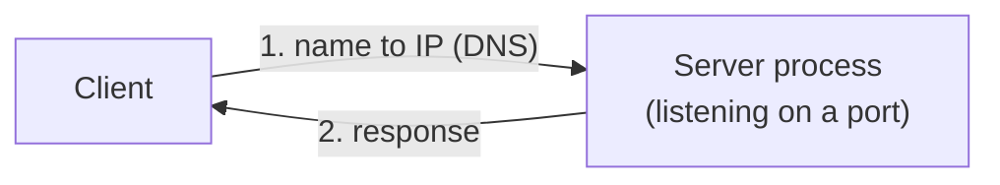

# Session 4: Networking — How Services Talk

**ITA Software Architecture 2026 Fall | 3 hours | Foundations block (hands-on)**

> Every architecture you'll read this semester is really *services talking over a network* — a browser to a server, a server to a database, one microservice to another. Today we open that up: what a **port** is, how a name becomes an address (**DNS**), how a request actually finds a server, and — the part that shapes every distributed design — **why the network is unreliable**. Keyboard-first; you'll watch real requests succeed and fail.

---

## Learning Goals

- Explain the **client–server model** and trace a request's round-trip: name → address → port → process → response.
- Understand **ports and listening processes**, and the difference between `localhost`, `0.0.0.0`, and a real address.
- Resolve names to addresses with **DNS**, and know why services address each other by *name*, not number.
- Reason about **network failure** — latency, timeouts, connection-refused, partial failure — and why it makes distributed systems hard.

---

## Before Class

- Your **webtop Linux container** from Session 2 running, with a terminal open and your Git repo cloned inside it.
- That's it — we build on the `curl` you met in Session 3.

---

## Today's Teachings

### Part 0 — Warm-up (10 min)
Last week you ran `curl https://api.github.com/...` and got JSON back. *Between pressing Enter and the reply arriving, what actually happened?*

### Part 1 — The client–server model & a request's journey (30 min) — blackboard

**The shape.** A **client** wants something from a **server**; they exchange messages over a network.


Every client (a browser, a phone app, another service, `curl`) sends a **request** and gets a **response** back. "The Internet" in the middle stands for all the network hops the message actually crosses. That is the mental model for the rest of the semester: **an architecture is boxes (processes) connected by these request/response wires.**

**The journey.** How does one request actually get there and back? It can be modelled in these four steps:


A web server does not have a name, it has an **IP address**. The name is just a lookup key — easier for people to remember than an IP address.

1. **Name → address.** `api.github.com` isn't a place. The client asks a **DNS server**: *what's the IP for this name?*
2. The DNS server **replies with the IP address** of the machine you actually want.
3. **Address → port → process.** The client now makes its **HTTP request straight to that IP**, on a **port** (`:443` = HTTPS, `:80` = HTTP, `:22` = SSH). An IP reaches a *machine*; the port picks the *program* on it.
4. A program is **listening** on that port, handles the request, and the server **responds with the data** — back down the same connection.

### Part 2 — Ports & listening processes (35 min) — keyboard, the set-piece

> **Today's hands-on parts (2, 3, 4, 5) all run *inside the webtop container*, not on your laptop** — the same terminal you used in Sessions 2–3. `python3`, `curl`, and `getent` are Linux tools that live in the container, and `localhost` here means *the container itself*, not your host machine. Mixing up the two machines is the easiest way to confuse yourself today — if a command behaves oddly, first check which machine your terminal is on.

Make a server appear and talk to it:

```bash
python3 -m http.server 8000        # this container is now a web server on port 8000
curl http://localhost:8000         # talk to it from inside the same container
# ...or open http://localhost:8000 in the browser inside the webtop desktop
```

- **A port is a door a process listens on.** Only one process per port — try starting a second server on `8000` and read the *"address already in use"* error.
- **`localhost` vs `0.0.0.0` vs a real address:** `localhost` (127.0.0.1) is "only this machine"; `0.0.0.0` means "accept from anywhere." Start the server on each and see who can reach it.
- Kill it and watch `curl` fail — the door is closed now (foreshadows Part 5).

### Part 3 — Names: DNS (25 min) — keyboard
Where does `localhost` — or `api.github.com` — come from?

```bash
getent hosts localhost             # a local name → /etc/hosts, no DNS
getent ahosts api.github.com       # a real name → DNS lookup; often several IPs for one name
```

- **`getent hosts` / `getent ahosts <name>` resolve a name the way any program does.** They follow the system's name-resolution order (`/etc/nsswitch.conf`): the local `/etc/hosts` file first, then **DNS**. `localhost` comes straight from the file (`127.0.0.1`, no network); `api.github.com` has to ask DNS — and a busy site usually answers with **several IPs for one name**, which is load balancing glimpsed in the wild. (`getent ahosts api.github.com | awk '{print $1}' | sort -u` — a Session 3 pipe — trims it to the distinct IPs.)
- The dedicated DNS tool is **`dig`** (`dig +short api.github.com`) — worth knowing the name — but it currently crashes in this webtop image, so we use `getent` today.
- A **hostname** is a stable name; the **IP** behind it can change. That indirection is what lets you move or scale a service without callers changing their code.

### Part 4 — Remote machines, (15 min) — keyboard
Reaching *another* machine is just the same round-trip to a different address. SSH is one such service (port 22): `ssh user@host` opens a shell on the far side; the terminal skills from S2 work identically there.

**Try it.** From your webtop terminal:

```bash
sudo apt install openssh-client          # if `ssh` isn't already there

ssh student@<ip-on-the-board>             # password is on the board; first time, type "yes" to trust the host
hostname                                  # not your webtop — a machine somewhere else
cat /etc/os-release                       # a real cloud Ubuntu box
uptime                                    # how long this VM has existed (not long)
exit                                      # back to your webtop

ssh student@<ip-on-the-board> hostname    # SSH can also run one command without opening a shell
```

The point: nothing about "remote" is special — it's the same **name → port → process → response** as Part 1, just to an address that happens to be in another country.

### Part 5 — The network is unreliable (25 min) — blackboard + demo — the payoff
Everything above assumed the request arrives. It often doesn't:

```bash
curl --max-time 3 http://localhost:9999          # nothing listening → connection refused
curl --max-time 3 https://httpbin.org/delay/10   # too slow → timeout
```

- **Failure modes:** connection refused (no one home), timeout (too slow / lost), and the nasty one — **partial failure** (the request arrived and did its work, but the *reply* was lost, so the caller can't tell).



- **The punchline:** a network call is *not* a function call. This single fact drives retries, timeouts, idempotency, and every hard trade-off in the distributed half of this course. **Session 18 (events)** and **Session 19 (microservices)** are, in large part, about living with this.

### Part 6 — Wrap-up (10 min)
The cheat-sheet: name → address → port → process → response, over a network that can drop any of it. Commit today's notes/commands.



Every arrow can be slow (**latency**), **refused** (nothing listening), or silently **dropped** (partial failure) — that's the whole distributed half of the course in one picture.

---

## Exercise (in class)

Using only the terminal, save your commands to `answers.sh` and push:

- Start a server (`python3 -m http.server`) on a port of your choice, and fetch it with `curl`.
- Resolve two public hostnames with `getent ahosts`; note that one has several IPs (that *is* load balancing).
- Trigger **two** different network failures on purpose (a refused connection and a timeout) and record what `curl` reports for each.
- One sentence: *why can't the client tell a "lost reply" apart from a "server never did the work"?*
- **Commit and push** to your repo.

---

## After Class

- In one sentence: what does DNS give you that hard-coding an IP wouldn't?
- **Next week is Docker + the group assignment** — make sure Docker Desktop still runs on your laptop.

---

## Optional

- [optional] *Computer Networking: A Top-Down Approach* — Chapter 1 only, for the request-journey picture.
- [optional] Julia Evans' *How DNS works* zine and her *networking* comics — friendly and concrete.
- [optional] *Fallacies of Distributed Computing* — the classic list; skim it and keep it in mind all semester.
