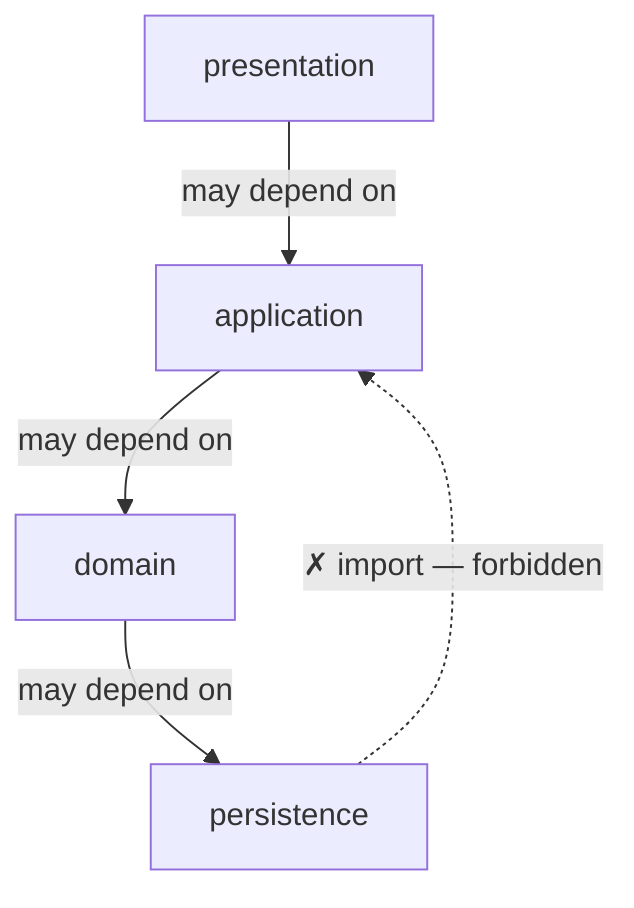
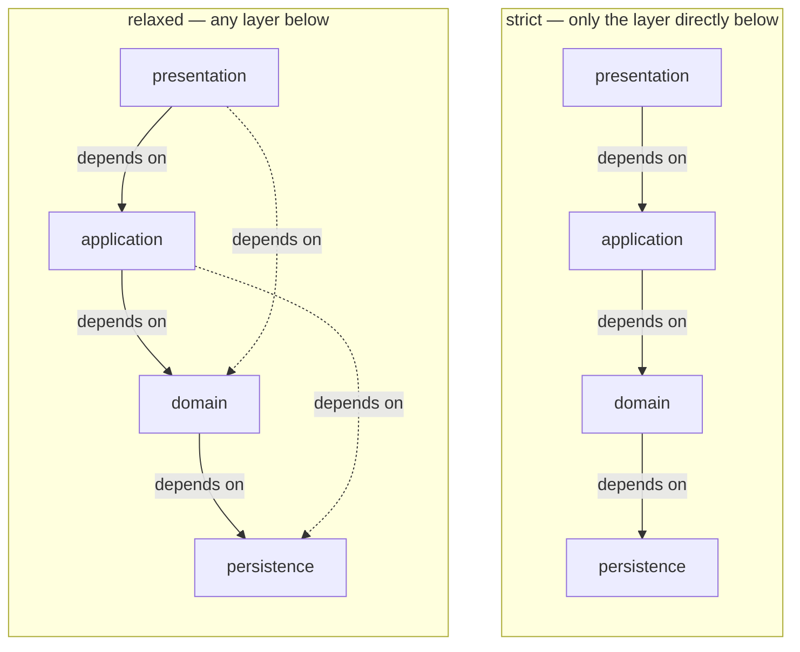

# Session 8: Layered Architecture

**ITA Software Architecture 2026 Fall | 3 hours**

> The oldest architectural style still in everyday use. Layers are easy to draw, easier to misuse. Today we ask: what makes a stack actually layered? Is Vibe layered? And how do you spot a layered architecture that has quietly become spaghetti? After class, you'll change a real system's persistence layer and test how layered it actually is.

---

## Learning Goals

- Define a **layer** and the **dependency-direction** rule that makes a stack "properly" layered.
- Recognise the canonical web layers (presentation, application, domain, persistence).
- Judge whether a real codebase is layered — including Vibe — by looking at *dependencies*, not folders.
- Name the quality attributes layered buys you and the ones it costs.

---

## Before Class

- Pick an open-source project on GitHub you can read, written in a language you know. Have it cloned (or at least bookmarked) and skim its top-level folders before class. Examples: Spring PetClinic, a Django app, an Express API, a Ktor backend, a Nest service — anything with visible structure.
- [optional] One sentence: a codebase where you've felt "the layers exist but everything touches everything anyway".

---

## Today's Teachings

### Part 1 — What "layered" means (25 min)

In class we'll walk through a tiny example: a textbook 4-layer notes service. Two versions, same shape:

- `example-kotlin/` — Ktor + Postgres
- `example-python/` — FastAPI + Postgres

Both run with one command: `docker compose up --build` from inside the folder. Pick whichever language you're more comfortable in.

The runnable code lives right here in this session's folder:

```bash
cd 08._layered_architecture/example-kotlin   # or example-python
docker compose up --build
```

A **layer** is a horizontal slice of the system. The classic web stack has four:

- **presentation** — receives requests, renders responses
- **application** — orchestrates use cases, coordinates the layers below
- **domain** — business rules and the model of the world
- **persistence** — talks to the database, files, external systems

### The dependency rule

> The rule that *makes* this stack layered: **dependencies point downward only**.
>
> - A layer may call the layer below.
> - A layer **may not** call a layer above.
> - Ideally, a layer doesn't reach sideways either.

**Dependency, not data.** The arrows mean *imports*, not *data flow* — return values travelling back up are normal. What's forbidden is persistence's code importing from application or presentation.



Two flavours: **strict** (each layer calls only the next layer down) and **relaxed** (a layer can reach any layer below). Most real systems are relaxed.



Note how this connects to last week's vocabulary:
- The boxes are **components** (S6).
- The horizontal lines are **boundaries** (S6).
- "Arrows point down" is a **convention** the system commits to (S6).
- "I can swap one layer without touching the others" is a **maintainability** claim (S7).

### Part 2 — Is Vibe layered? (35 min)
Open question, investigated together. Use the file browser and Vibe.

First, the top-level. `vibe/` contains:

- `cli/` — the interactive terminal interface
- `core/` — the agent, LLM clients, tools, prompts, telemetry
- `acp/` — an alternative entrypoint
- `setup/` — install/setup helpers

Looks layered: `cli/` is presentation, `core/` is application + domain. The dependency rule should say *`cli/` imports from `core/` and not the other way around*.

Ask Vibe: *"List every import where `cli/` references something in `core/`, and every import where `core/` references something in `cli/`. Tell me the direction the dependency flows."*

Verify on at least one file. If the arrows go one way only, the outer shape is layered. If they go both ways, it isn't.

Now zoom into `core/`. Look at its contents:
- `llm/` with a `backend/` folder containing one file per vendor (anthropic, mistral, vertex, generic, …)
- `agents/`, `session/`, `tools/`, `prompts/`, `skills/`
- cross-cutting: `logger.py`, `tracing.py`, `telemetry/`, `middleware.py`

Is *this* layered? Probably not the way the canonical four-layer stack is. It's organised by capability, not by horizontal slice. The `llm/backend/` folder, in particular, looks like something else entirely. (We'll name that something else next week.)

So what's the verdict? The grep is more interesting than "yes" or "no". `cli/` leans on `core/`, as a presentation-over-application stack should — but you'll also find a few imports running *upward*, from `core/` back into `cli/`. That's an **upward dependency**, exactly what the arrows-down rule forbids (named in Part 3). So: **Vibe's outer shape *looks* layered but leaks at the edges, and its `core/` is something else entirely on the inside.** Hold both halves of that thought — they're the bridge to next week.

### Part 3 — Why it works when it works (25 min)
Layered's pay-offs, in QA terms:

- **Maintainability.** Swap Postgres for MySQL by replacing the persistence layer. Swap the HTML framework by replacing the presentation layer. *In theory* — reality is messier, but the theory is the goal.
- **Testability.** Each layer can be tested in isolation by stubbing the layer below. Vibe's `tests/` is layer-respecting in places.
- **Onboarding cost.** A new developer can read one layer at a time. That's a real cost benefit.
- The arrows-down rule is a *load-bearing convention*: small enough to fit on a sticker, big enough to shape months of design discipline.

### Part 4 — How it falls apart (35 min)
Three classic failure modes. For each, find an example — in [Vibe](https://github.com/Ek-Ita-Swa-Iti/mistral-vibe-ek-ita), or in your bring-your-own codebase.

- **The shortcut.** A presentation file imports directly from persistence, skipping the layers in between. *In Vibe:* would `cli/` ever import from `core/llm/backend/` directly? Ask Vibe to look.
- **The God-domain.** Business logic ends up in controllers because the domain layer is empty. *Diagnostic:* a controller file over 400 lines.
- **The anaemic stack.** Layers exist as folders, but every change touches all of them. *Diagnostic:* pick a recent commit; how many layers did it modify?

The lesson: **layered is a discipline, not a folder structure.** A `domain/` folder doesn't make you layered. The dependency rule does.

Ask Vibe: *"Find one place in this codebase where a layering violation either exists or would be tempting. Show me the file and explain the temptation."* Verify by opening the file.

### Part 5 — Read a real one: bring-your-own (40 min)
In pairs, using the codebase one of you brought:

- What are the layers in your system?
- Are the dependency rules respected? Use your agent to find imports that cross layers in the wrong direction.
- Find one violation. (If you can't find one, find one place a violation would be tempting.)
- What one concrete suggestion would you make as a new joiner tomorrow?

Write a 5-line dossier per pair. Drop it in your semester notebook.

### Part 6 — Synthesis (10 min)
One pair shares. We end with the bridge to next week: **Vibe's `core/` isn't layered.** It's structured around adapters over multiple LLM vendors — Mistral, Anthropic, Vertex, generic, more. That shape has its own name. Next session: ports and adapters.

---

## Exercise

Take the bring-your-own codebase. On paper or in a diagram tool:

- Draw its layers.
- Mark every place a layer is broken with a red dot.
- One sentence per red dot: why is it there?
- One sentence at the bottom: which QA is the breakage costing you?

Bring it to session 9.

---

## Investigation (after class)

Same pattern as before: ask, verify, write up. Pick **two** of the four.

### Prompt 1 — The dependency direction across cli ↔ core
> "In `mistral-vibe-ek-ita`, list every import statement where `cli/` references `core/`, and every import statement where `core/` references `cli/`. Summarise: which way does the dependency flow?"

**Verify:** open two files Vibe names. Do the imports it cites actually exist? Is the direction it claims correct?

### Prompt 2 — Is `core/` layered?
> "Looking only at the contents of `core/`, would you describe this as a layered architecture? If yes, name the layers and the dependency rule. If no, describe the shape it has instead."

**Verify:** list two top-level items in `core/` Vibe used in its argument. Are they really arranged the way Vibe describes? If the agent over-claims layering, note where.

### Prompt 3 — A layering violation in your bring-your-own
> "Here is the top-level structure of [BYO repo]. Based on names and any READMEs, identify the layers and one place a layering violation might exist. Tell me the file path."

**Verify:** open the file. Does the violation actually exist, or did the agent guess? Either way, note what convinced you.

### Prompt 4 — Swap your exam project's database to MySQL
> "My 2nd-semester exam project uses [current DB engine — not MySQL] for its database. I want to migrate it to MySQL. Before you touch anything, tell me every file and every layer you expect to touch, and why. Then make the change. When you're done, list every file you actually touched, grouped by layer."

Need a MySQL instance to migrate to? Reuse the [containerised MySQL warm-up from Session 6](../06._intro_to_software_architecture/README.md#part-0--warm-up-mysql-but-containerised-15-min). If you use that exact setup, use the credentials described there (`root` / `my-secret-pw`, `localhost:3306`).

**Verify:** run the app against the new MySQL database — does it actually read and write correctly? Compare Vibe's *before* prediction to its *after* file list — did the change stay inside the persistence layer, or did it ripple into application, domain, or presentation? If it touched something above persistence, that's not automatically wrong (the layered rule does permit application/domain depending on persistence) — but it should be *explainable*, not a surprise. Note which QA this is putting to the test (maintainability) and whether your project actually delivered on the "swap the database, nothing else changes" claim from Part 3.

### Deliverable

Half a page in your semester notebook:

- **What I investigated** — which two prompts.
- **One claim my agent got right** — and the file or import that proves it.
- **One claim that was vague, wrong, or oversold** — and how you checked.
- **One QA layered buys, and one it costs** — in your own words, in the context of one specific codebase you looked at.

---

## After Class

- Skim ahead: session 9 covers **hexagonal architecture** (ports and adapters). It's the answer to the failure modes of layered — and to the shape we noticed inside Vibe's `core/`.
- If you didn't run the in-class example yourself, do it now. `cd 08._layered_architecture/example-kotlin` (or `example-python`), and `docker compose up --build`. Then `grep -rh "^import com.example.notes" src/main/kotlin` (Kotlin) or `grep -rh "^from \.\." notes` (Python) — see the dependency rule with your own eyes.

## Optional

- [optional] Fowler, M. — *Patterns of Enterprise Application Architecture*. The canonical layered reference. Skim the index, read the chapter on Layer Supertype if you're curious.
- [optional] Search the repos you brought today for the phrase "clean architecture" — it's a layered cousin we're not teaching but you'll meet in the wild.
