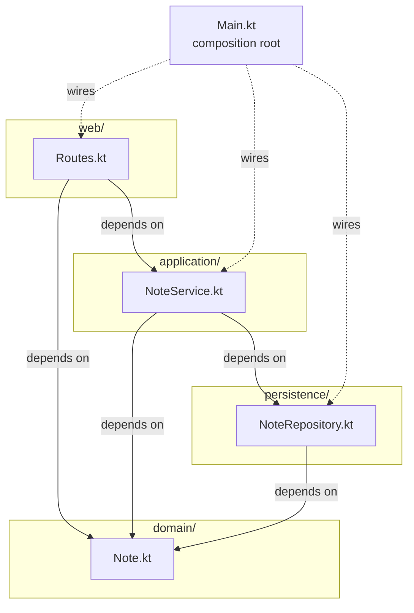

# notes-layered — a textbook 4-layer Kotlin service

A minimal Ktor + Postgres notes service, used as the canonical clean-layered example in **Session 8 — Layered Architecture**. Used in class to show what a layered architecture looks like *before* we look at Vibe and discover that Vibe is only partially layered.

## Run it

From this folder:

```bash
docker compose up --build
```

First build takes a few minutes (Gradle pulls Kotlin + Ktor + Postgres driver). Subsequent runs are fast.

Then:

```bash
curl localhost:8080/notes
curl -X POST localhost:8080/notes \
  -H 'Content-Type: application/json' \
  -d '{"title":"hello","body":"first note"}'
curl localhost:8080/notes/1
```

Stop with `Ctrl-C`, clean up with `docker compose down -v`.

## The four layers

```
src/main/kotlin/com/example/notes/
├── web/            ← presentation: HTTP routes
├── application/    ← use cases: orchestration
├── domain/         ← model + business rules
├── persistence/    ← database access
└── Main.kt         ← composition root: wires the layers together
```

The dependency rule: **arrows point downward only**.

| Layer         | Depends on             | Knows nothing about     |
|---------------|------------------------|-------------------------|
| `web/`        | `application`, `domain`| `persistence`           |
| `application/`| `domain`, `persistence`| `web`                   |
| `domain/`     | *(nothing)*            | everything else         |
| `persistence/`| `domain`               | `web`, `application`    |



Verify by running:

```bash
grep -rh "^import com.example.notes" src/main/kotlin
```

You won't find:
- any `web/` file importing from `persistence/`
- any `persistence/` or `domain/` file importing from `web/` or `application/`
- any `domain/` file importing from anywhere in this codebase

That's the whole point. The folder names are just labels — the imports are the contract.

## Why this example

It is deliberately small and deliberately textbook. One entity (`Note`), one validation rule (title is non-blank, ≤ 100 chars), one storage backend (Postgres), one transport (HTTP/JSON). Every concept S8 teaches has exactly one place to point at:

- **A layer** → one of the four folders.
- **Dependency direction** → the `import` lines.
- **Boundary** → the line between `application/` and `persistence/`.
- **Convention** → "imports go down only", visible from a single grep.
- **Maintainability** → swap Postgres for MySQL by editing only `persistence/NoteRepository.kt`.

## Suggested in-class beats

Show this in Part 1 (or as the opener to Part 2) *before* asking "is Vibe layered?".

1. Open the four folders side by side. Name each layer.
2. Run the grep above. Watch dependencies flow one direction.
3. Show `application/NoteService.kt` — point at `NoteRules.validateTitle(title)` (domain rule) and `repo.insert(...)` (persistence call). One service, two layers below, no layer above.
4. Suggest a violation: "what if `web/Routes.kt` called `NoteRepository` directly?" Walk through what would break — the validation rule in `NoteService` gets bypassed. That's the **shortcut** failure mode from Part 4.

Then go to Vibe. Compare. `cli/ → core/` looks like this example's `web/ → application/`. `core/`'s internals do not. Park the tension for S9.

## Files at a glance

- `build.gradle.kts`, `settings.gradle.kts` — Gradle config.
- `Dockerfile` — multi-stage build; no Gradle wrapper needed on the host.
- `docker-compose.yml` — Postgres + app, with healthcheck-gated startup.
- `src/main/kotlin/com/example/notes/Main.kt` — composition root.
- `src/main/kotlin/com/example/notes/{domain,persistence,application,web}/` — one file per layer.
- `src/main/resources/logback.xml` — log config.

## What this example does *not* do

Deliberate omissions, to keep the layered story clean:

- **No repository interface.** In hexagonal (S9) the domain *owns* an interface that persistence implements. Here, `application/` imports the concrete `NoteRepository` directly — that's the layered way. Don't refactor it; it's the contrast S9 needs.
- **No DTOs.** `Note` (a domain type) is returned directly over the wire. In bigger systems you'd separate the wire format from the domain. Out of scope.
- **No tests.** Adding tests is a great follow-up exercise — and a chance to feel layered's testability claim in your hands. Stub `NoteRepository`, test `NoteService` in isolation.
- **No migrations tool.** Schema is created on startup with `CREATE TABLE IF NOT EXISTS`. Real systems use Flyway/Liquibase. Out of scope.

## Troubleshooting

- **`gradle: command not found` outside Docker** — that's fine. Builds happen inside the Docker image; no Gradle install required on the host.
- **Port 8080 already in use** — change the `ports` line in `docker-compose.yml`.
- **First build is slow** — yes. Gradle is warming up. Subsequent rebuilds use Docker layer caching.
