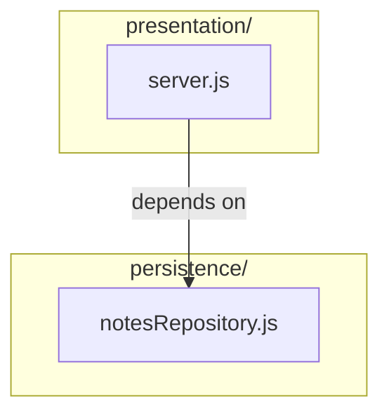
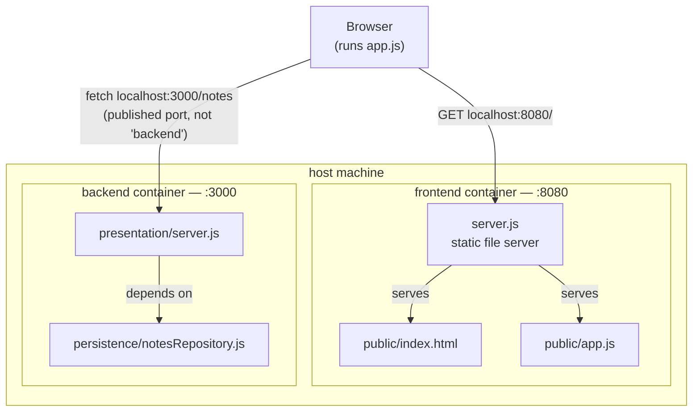

# notes-layered (Node.js) — the absolute minimum layered example

Stripped down further than the Kotlin and Python siblings in `../example-kotlin/`
and `../example-python/`: **two layers only** (presentation, persistence — no
application, no domain), **zero npm dependencies** (Node's built-in `http`
module, no Express), and **two separate Docker images** — a backend and a
frontend that reads from it. Use this one when you want the dependency-rule
story with nothing else competing for attention.

## Run it

From this folder:

```bash
docker compose up --build
```

Then open `http://localhost:8080` in a browser — the frontend fetches
`http://localhost:3000/notes` from the backend and renders the list.

Or talk to the backend directly:

```bash
curl localhost:3000/notes
curl localhost:3000/notes/1
curl -X POST localhost:3000/notes \
  -H 'Content-Type: application/json' \
  -d '{"title":"hello","body":"first note"}'
```

Stop with `Ctrl-C`, clean up with `docker compose down`.

## The two layers (backend)

```
backend/
└── src/
    ├── presentation/
    │   └── server.js        ← receives HTTP requests, renders JSON
    └── persistence/
        └── notesRepository.js  ← hardcoded data — see below
```

| Layer            | Depends on    | Knows nothing about |
|-------------------|---------------|----------------------|
| `presentation/`    | `persistence` | —                    |
| `persistence/`     | —             | `presentation`       |



Verify by running:

```bash
grep -rn "require(" backend/src
```

You'll find exactly one cross-layer import: `presentation/server.js` requiring
`../persistence/notesRepository`. Nothing in `persistence/` requires anything
from `presentation/`. That one line is the entire dependency rule for this
example.

## Why no application or domain layer

Deliberate, not an oversight. The canonical four-layer stack (Part 1) needs
all four to make its point about *orchestration* and *business rules* living
apart from *plumbing*. This example isn't trying to teach that — it's trying
to isolate the **dependency-direction** rule itself, with as little else on
screen as possible. Two layers is the smallest number where "may depend on
below, not above" is even a meaningful sentence.

## The persistence layer is hardcoded — on purpose

`notesRepository.js` returns data from a plain in-memory array, not a
database. That's a **development-only stand-in**, explicitly commented as
such in the file. It exposes exactly three functions — `findAll()`,
`findById(id)`, and `create(title, body)` — and that's the whole contract
`presentation/server.js` depends on.

**Left out for now, on purpose:** a second persistence layer that reads from
a real database instead. Swapping one in later should mean writing a new
file that exposes the same three functions and pointing the composition root
at it — without touching `presentation/server.js` at all. That's the same
"swap Postgres for MySQL... in theory" claim from Part 3, set up so it can
actually be tested against this codebase when the time comes.

## Backend and frontend as separate Docker images

`docker-compose.yml` builds two independent images — `backend/` and
`frontend/` — each with its own `Dockerfile`, each exposing its own port.
Neither has a build step or a framework: the frontend is one HTML file, one
JS file, and a ~20-line static file server.



The frontend container never talks to the backend container directly — it only ever serves static files. Every arrow that reaches the backend starts at the browser, not at the frontend container. That's the point of the gotcha below.

**The gotcha worth walking through in class:** `frontend/public/app.js` calls
`http://localhost:3000`, not `http://backend:3000`. That's not a mistake.
`app.js` runs *inside the user's browser*, not inside the frontend
container — the browser has never heard of the Docker network's internal
service names, so it has to use the port published to the host. Compare that
to server-side inter-container calls (like the ones in Session 5), which *do*
use the service name. Same Docker Compose file, two different rules,
depending on which side of the network boundary the code actually runs on.

## What this example does *not* do

- **No application or domain layer.** See above — deliberate, for focus.
- **No database.** The persistence layer is hardcoded; see above.
- **No tests.** A natural follow-up: stub `notesRepository`, test
  `server.js`'s routing in isolation.
- **No build step for the frontend.** Plain HTML and vanilla JS, on purpose —
  a bundler would be one more thing standing between the dependency rule and
  the screen.
- **No PUT/DELETE.** `GET /notes`, `GET /notes/:id`, and `POST /notes` only —
  enough to demonstrate the layers without building out full CRUD.

## Troubleshooting

- **Port 3000 or 8080 already in use** — change the relevant `ports` line in
  `docker-compose.yml`.
- **Frontend loads but the list stays empty** — open the browser console;
  a `Failed to fetch` almost always means the backend container isn't up yet,
  or `localhost:3000` is blocked/remapped. `docker compose ps` to check both
  containers are running.
