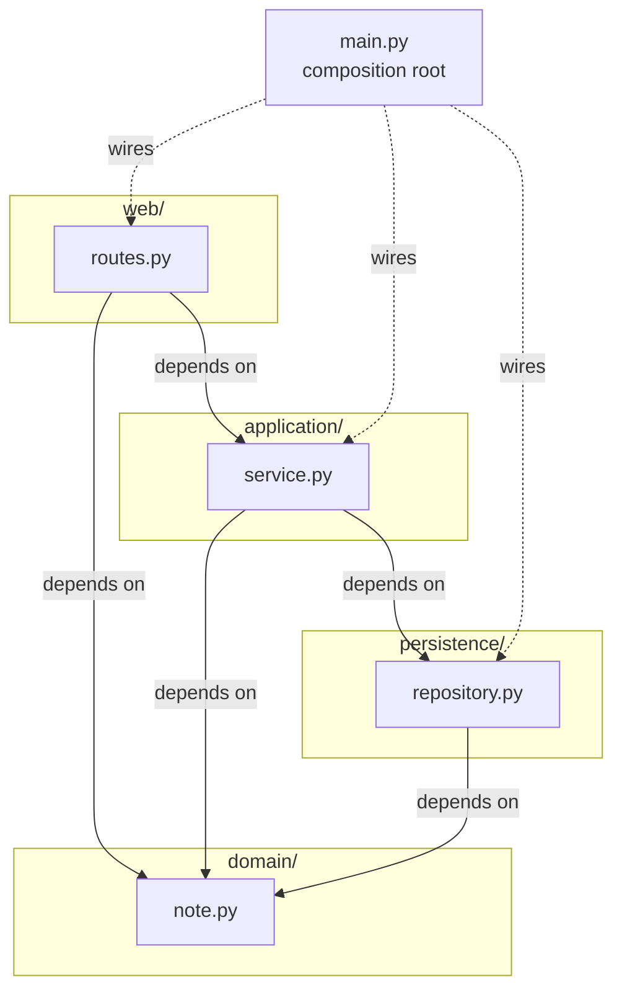

# notes-layered (Python) — a textbook 4-layer FastAPI service

A minimal FastAPI + Postgres notes service. Functionally identical to the Kotlin sibling in `../example-kotlin/`. Same four layers, same endpoints, same database — different language, same shape. Use one or both in **Session 8 — Layered Architecture** depending on which language the cohort is more comfortable with.

## Run it

From this folder:

```bash
docker compose up --build
```

Then:

```bash
curl localhost:8080/
curl localhost:8080/notes
curl -X POST localhost:8080/notes \
  -H 'Content-Type: application/json' \
  -d '{"title":"hello","body":"first note"}'
curl localhost:8080/notes/1
```

Stop with `Ctrl-C`, clean up with `docker compose down -v`.

FastAPI ships an OpenAPI viewer at `http://localhost:8080/docs` — open that in a browser to play with the endpoints.

## The four layers

```
notes/
├── web/            ← presentation: FastAPI routes + pydantic wire models
├── application/    ← use cases: orchestration
├── domain/         ← model + business rules (stdlib only)
├── persistence/    ← database access (psycopg)
└── main.py         ← composition root: wires the layers together
```

The dependency rule: **arrows point downward only**.

| Layer            | Depends on               | Knows nothing about     |
|------------------|--------------------------|-------------------------|
| `web/`           | `application`, `domain`  | `persistence`           |
| `application/`   | `domain`, `persistence`  | `web`                   |
| `domain/`        | *(stdlib only)*          | everything else         |
| `persistence/`   | `domain`                 | `web`, `application`    |



Verify by running:

```bash
grep -rh "^from \.\." notes
```

You won't find:
- any `web/` file importing from `persistence`
- any `persistence/` or `domain/` file importing from `web` or `application`
- any `domain/` file importing from anywhere in this codebase (it sticks to stdlib)

That's the whole point. The folder names are just labels — the imports are the contract.

## Differences from the Kotlin sibling

Both examples teach the same thing. The differences are language-idiomatic, and worth pointing at in class:

- **`domain/note.py` uses stdlib only** — a frozen `dataclass`, a plain `Exception`, a free function for the validation rule. No FastAPI, no pydantic, no database. That's how clean a domain layer can get in Python.
- **`web/routes.py` defines its own pydantic models** (`CreateNoteRequest`, `NoteResponse`) — the wire format lives in the presentation layer, not the domain. The Kotlin version reused the domain `Note` for serialisation, which is a small layered compromise. Python lets us keep the layers tighter without much extra code.
- **`persistence/repository.py` uses raw SQL via psycopg**, mirroring the JDBC choice in the Kotlin version. No ORM. The persistence layer looks like persistence.
- **Composition root is `main.py`**, mirroring `Main.kt`. Same role: instantiate the pool, init the schema, wire repository → service → router into a FastAPI app.

If you teach this side-by-side with the Kotlin version, the punchline is: **layering is about dependency direction, not about a language or a framework**. The two examples look almost identical when you stand back, because the *shape* is the architecture.

## Suggested in-class beats

If you use the Python version live:

1. Open the four folders. Name each layer.
2. Run the grep above. Watch dependencies flow one direction.
3. Open `application/service.py` — point at `validate_title(title)` (domain rule) and `self._repo.insert(...)` (persistence call). One service, two layers below, no layer above.
4. Open `domain/note.py` — only stdlib imports. Show that the domain doesn't even know it lives inside a web service.
5. Suggest a violation: "what if `web/routes.py` called `NoteRepository` directly?" Walk through what would break — `validate_title` gets bypassed. That's the **shortcut** failure mode.

Then go to Vibe. Compare.

## What this example does *not* do

Same deliberate omissions as the Kotlin version:

- **No repository interface in the domain.** `application/` imports the concrete `NoteRepository`. That's the layered way. S9 will invert it.
- **No tests.** A great follow-up exercise — stub `NoteRepository`, test `NoteService` in isolation.
- **No migrations tool.** Schema created on startup with `CREATE TABLE IF NOT EXISTS`. Real systems use Alembic.
- **No async.** psycopg supports it; FastAPI loves it. Adding async would distract from the layered story. Keep the route handlers synchronous.

## Troubleshooting

- **Port 8080 already in use** — change the `ports` line in `docker-compose.yml`.
- **`psycopg.OperationalError: connection failed`** — the healthcheck should prevent this; if it happens, the DB took longer than 40 seconds to come up. Re-run `docker compose up`.
- **First build is slow** — pip resolving `psycopg[binary]`. Subsequent rebuilds use Docker layer caching.
