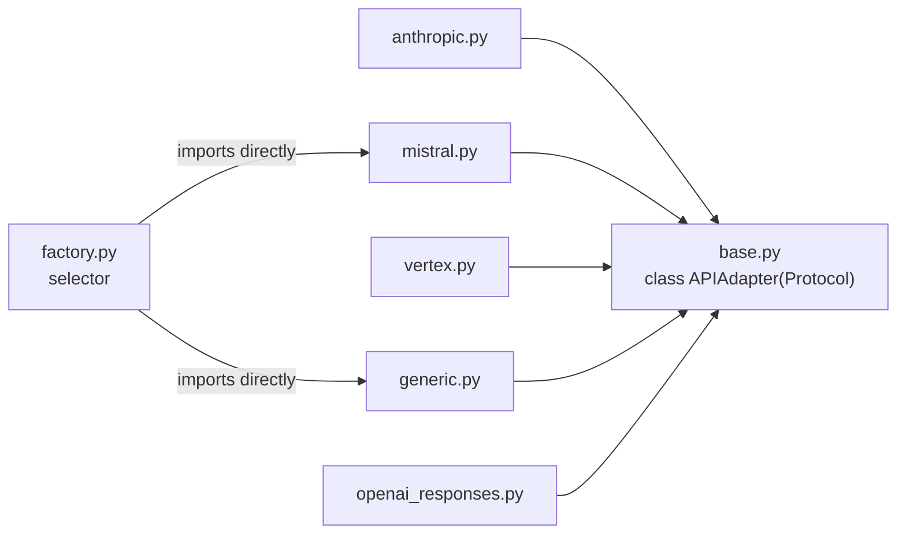
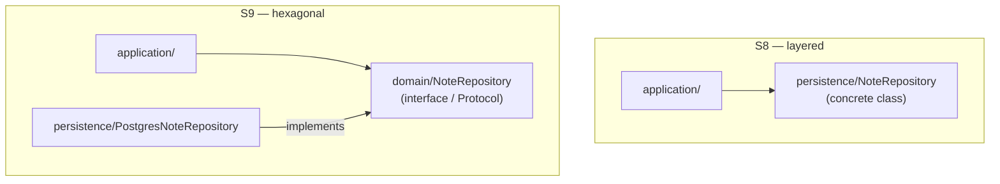
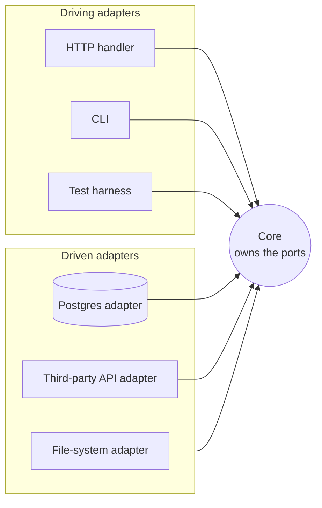

# Session 9a: Hexagonal Architecture (Ports & Adapters)

**ITA Software Architecture 2026 Fall | 3 hours**

> **Temporary folder.** Split out of Session 9 on 2026-09-23 so Session 9 can focus on layered architecture only. Name and placement are provisional.

> Layered told us where the lines should go. Hexagonal asks a sharper question: *who depends on whom across those lines?* The answer flips one of the arrows — and the codebase you've been reading for three weeks has been doing this all along.

---

## Learning Goals

- Define a **port**, a **driving adapter**, a **driven adapter** and the **composition root** in your own words — and point at each one in a running example.
- Build new adapters (a driven one, a driving one, a test fake) without changing a line of the core.
- See why hexagonal's defining property is **dependency direction pointing inward** — and how that's the same diagnostic we used for layered, just rotated.
- Read Vibe's `core/llm/backend/` and recognise the ports-and-adapters shape in real, working code.
- Compare the S8 layered notes example to its hexagonal refactor — one inversion, visible in the imports.
- Name the quality attributes hexagonal buys, the ceremony it costs, and when *not* to reach for it.

---

## Before Class

- Pull the latest course repo and have Docker running. Bring your Session 9 Part 2 code (the JSON API and MongoDB persistence files) — you'll reuse it.
- Have Vibe running and `vibe/core/llm/backend/` bookmarked. We'll open `base.py` together.
- [optional] One sentence: a place in the codebase you brought to S8 where "swap the database" or "add a second integration" would be expensive. That's a candidate for a port.

---

## Today's Teachings

### Part 1 — Ports & adapters, live: the hexagonal example (20 min)

Same notes API, same `curl` commands — rebuilt so the arrow you found at the end of Session 9's Part 2 exercise points the other way. The instructor demos it; the README only gives you the map.

```bash
cd 09_.a_hexagonal_architecture/example-hexagonal
docker compose up --build
```

It's the same plain JavaScript as Session 9's `example-node/` — same `require`s, zero dependencies — so the only difference is the architecture. JavaScript has no `interface` keyword, so the port is written as a **base class** whose methods only throw; adapters `extends` it.

The four words to take away, and where each one lives in the example:

| Word | Meaning | In the example |
|------|---------|----------------|
| **Port** | A contract owned by the core, on the core's terms — *what* it needs, never *how* | `core/NotesRepository.js` |
| **Driven adapter** | Implements a port; the core uses it (storage, APIs, files) | `adapters/InMemoryNotesRepository.js`, `adapters/JsonFileNotesRepository.js` |
| **Driving adapter** | Calls into the core from outside (HTTP, CLI, tests) | `adapters/httpServer.js` |
| **Composition root** | The one place that knows both sides and wires them together | `main.js` |

The rule that makes it hexagonal: **every dependency points inward, toward the core.** The core imports nothing but its own port.

Follow along during the demo and keep these questions in mind:

- Run `grep -rn "require(" src/core`. What does the core depend on — and what *doesn't* it?
- The storage is swapped with `NOTES_STORE=file`. Which files changed? Compare with Session 9's Part 2, where you edited a line in `server.js`.
- Where did the "title and body are required" check move to, compared with `example-node/`? Why does that matter?

The example's own [`README.md`](example-hexagonal/README.md) has the diagram, the side-by-side comparison with `example-node/`, and the run instructions.

### Part 2 — Exercise: build your own adapters (40 min)

Pairs, in your own copy of `example-hexagonal/`. **One rule for everything below: nothing in `src/core/` may change.** If you feel you need to change the core, stop and discuss it in your pair — that's a sign the port is wrong, or that the code you're writing belongs somewhere else.

#### Part 2a — A new driven adapter: port your Session 9 code

Take your JSONPlaceholder persistence from Session 9's Part 2a and turn it into `adapters/JsonPlaceholderNotesRepository.js`, a class that `extends NotesRepository`. Plug it in from `main.js` (e.g. `NOTES_STORE=api`). The three `curl` commands must work unchanged.

Then ask: which files did you touch this time, compared with Session 9's Part 2? What did `extends NotesRepository` give you that Part 2 didn't — and what *doesn't* it check for you?

#### Part 2b — A new driving adapter: a command-line interface

Write `adapters/cli.js` so notes can be used from the terminal, with no HTTP involved:

```bash
node src/cli.js list
node src/cli.js add "hello" "first note"
```

`src/cli.js` is a second composition root: it builds a repository and a `NotesService` just like `main.js`, then hands them to your CLI adapter instead of the HTTP one. Try `add` with an empty title — you should get the core's validation error without writing any validation yourself.

Hint: `process.argv` holds the command-line arguments. Run it inside the container with `docker compose run --rm --build notes node src/cli.js list`, or locally with any recent Node.

#### Part 2c — Test the core without any infrastructure

Write `src/test/NotesService.test.js` (outside `core/` — the rule still holds) using Node's built-in test runner (`node:test` and `node:assert`). Give `NotesService` a fake repository — a small class of your own that `extends NotesRepository` (the service refuses anything else) — and test that:

- `create` with a missing title is rejected with a `ValidationError`,
- `create` with valid input hands the trimmed title and body to the repository.

Run it with `node --test` (inside the container: `docker compose run --rm --build notes node --test`). No Docker network, no HTTP, no files — the whole test takes milliseconds.

#### Part 2d — Stretch: MongoDB as an adapter

Turn your Session 9 Part 2b MongoDB persistence into a `MongoNotesRepository` adapter, with the `mongo` service back in `docker-compose.yml`. Same rule: nothing in `core/` changes.

**When you're done, answer in your pair:** in how many places can this system now be *entered* (driving adapters), and in how many ways can it *store* notes (driven adapters)? How many lines of `core/` did that cost?

### Part 3 — Vibe's `core/llm/backend/` is the canonical example (35 min)
Open three files in order. Follow along in your editor.

**1. `vibe/core/llm/backend/base.py`** — read the `APIAdapter` Protocol out loud.

```python
class APIAdapter(Protocol):
    endpoint: ClassVar[str]
    def prepare_request(self, ...) -> PreparedRequest: ...
    def parse_response(self, data, provider) -> LLMChunk: ...
```

This is the **port**. The core says: *anyone who wants to be an LLM backend must implement these two methods.* The core does not care who.

**2. `vibe/core/llm/backend/anthropic.py` and `vibe/core/llm/backend/mistral.py`** — open both, side by side. Two **adapters**. Two vendors. One shape. The port is upstream of them; they depend on it, not the other way around.

**3. `vibe/core/llm/backend/factory.py`** — the selector. At composition time, given config, hand back the right adapter.



Five adapters, one port — `base.py` depends on none of them. Note `factory.py` only *directly* imports `generic.py`/`mistral.py` (most vendors route through the OpenAI-compatible `GenericBackend`) — worth discovering in Part 3's investigation rather than being told.

Now verify. Ask Vibe:

> "In `vibe/core/llm/backend/`, list every import in `base.py`, `anthropic.py`, and `mistral.py`. Summarise: which way do dependencies flow?"

Open one of the files Vibe names. The expected pattern: vendor files import from `base.py` and `vibe.core.types`. `base.py` imports neither vendor. **The arrows point inward.**

Bridge to S8: last week we saw the *outer* arrows (`cli/` → `core/`) point downward. Today we saw the *inner* arrows (vendor adapters → port) point inward. **The two rules — layered and hexagonal — are the same diagnostic property applied to different parts of the same codebase.** Vibe uses both, deliberately.

Park this question for Part 5: *What would it take to add a sixth LLM vendor — a local Ollama backend?* Hold the question.

### Part 4 — The S8 notes service, refactored (45 min)
The runnable example again, this time with one inversion. Both versions sit side by side in the examples repo:

```bash
git clone <examples repo url>
cd ek-ita-swa-examples/09-hexagonal-architecture/example-kotlin   # or example-python
docker compose up --build
```

The single change to see:



S8: the application layer depends on the concrete repository directly. S9: it depends on the interface instead — and now the concrete repository depends on *that*, not the other way around. Same two files, one arrow flipped.

Three things to look at in the diff:

- **Where the port lives.** Kotlin: `domain/NoteRepository.kt` is now an interface. Python: `domain/repository.py` is a `Protocol`. The application layer imports the *port*, not the concrete class.
- **A second adapter.** Both examples now ship an `InMemoryNoteRepository` alongside the Postgres one. The pay-off is a unit test: `NoteService` is exercised in milliseconds with no Docker, no schema, no network.
- **The composition root.** `Main.kt` / `main.py` is the only file that knows both halves. It picks an adapter and hands it to the service.

Verification with `grep`, mirroring the S8 move:

```bash
# S8 layered: this returns a hit (application imports the concrete repo)
grep -rh "import.*persistence" example-kotlin/src/main/kotlin/com/example/notes/application

# S9 hexagonal: this returns nothing (application doesn't import persistence at all)
grep -rh "import.*persistence" example-kotlin/src/main/kotlin/com/example/notes/application
```

Same tool, opposite question. The rule is visible by what *isn't* there.

Now answer the parked question. Adding an Ollama backend to Vibe is *one new file* — `ollama.py` next to the others, implementing `APIAdapter`, registered in `factory.py`. The core does not change. That's the operational pay-off of ports.

### Part 5 — What it buys, what it costs (25 min)
Hexagonal buys:

- **Testability.** The service runs against in-memory adapters in unit tests, real ones in integration tests. Two test pyramid layers fall out for free.
- **Maintainability.** Swap an integration without touching the core. Vibe's five vendor files are the strongest possible demonstration.
- **Replaceability.** The most common real-world driver: "we might move off Postgres / off Stripe / off SendGrid." Ports buy optionality.

Hexagonal costs:

- **Ceremony.** Every external dependency becomes an interface plus at least one implementation. Count the new files in the S9 example vs S8 — that's the literal cost.
- **Indirection.** A reader following a request from HTTP to database now stops twice — at the port and at the adapter. New joiners feel this.
- **Misuse risk.** Interfaces with exactly one implementation forever are pure overhead. If the second adapter never arrives, the port didn't earn its keep.

Quick exercise: name **two QAs hexagonal buys** and **one it costs**. Compare with your neighbour.

**When *not* to reach for hexagonal:** throwaway scripts, prototypes, code that will be rewritten before it has a second integration, systems with one obvious DB and zero realistic chance of swapping it. Pragmatic hexagonal — ports at the painful boundaries only — is what most real systems land on.

### Part 6 — Bring-your-own: where would a port help? (35 min)
In pairs, using one of the bring-your-own codebases from S8.

- Identify one external dependency the codebase has — a database, a third-party API, a file system, a message queue, an email service.
- Trace the imports: does the business logic import the integration directly, or through an interface?
- If directly: what would a port look like? What would the interface contain? Who would implement it?
- If through an interface already: how many adapters exist? Would adding a second be cheap or expensive?
- One concrete suggestion: a port worth adding — or a port that's overkill and should be removed.

5-line dossier per pair. Drop it in your semester notebook.

### Part 7 — Synthesis (10 min)
One pair shares. We end with the synthesis:

- **Layered** = arrows point down. Helpful for separation, weak on testability.
- **Hexagonal** = arrows point in. Helpful for testability and replaceability, costs ceremony.
- Most real systems are *both, in different parts*. Vibe is the proof: layered between `cli/` and `core/`, hexagonal inside `core/llm/backend/`.

Bridge to next week: the HTTP layer is the **driving adapter** on the hexagonal picture — the thing that translates an external protocol into a call on the core. Next session goes deep on what makes that translation good: REST constraints, resources, methods, status codes. We've drawn the shape; next we fill in the protocol.

---

## Exercise

Pick one of your own projects (or one of the bring-your-own codebases from S8). On paper or in a diagram tool:

- Draw the hexagon for its core.
- For each external dependency, draw an arrow. Is it pointing **in** (port + adapter) or **out** (core depends on the integration directly)?
- For one outward-pointing arrow: sketch the port that would invert it. What would the interface have on it?
- One sentence at the bottom: which QA would you be buying — and what's the ceremony cost in concrete file/class count?

Bring it to session 10.

---

## Investigation (after class)

Same pattern as the last three sessions: ask, verify, write up. Pick **two** of the three.

### Prompt 1 — Vibe's LLM backends as ports & adapters
> "Open `vibe/core/llm/backend/`. List every import in `base.py` and in two of the vendor files (e.g. `anthropic.py`, `mistral.py`). Confirm or refute: the vendor files depend on `base.py`, and `base.py` does not depend on any vendor file."

**Verify:** open the files Vibe names. Do the imports it cites actually exist? Does `base.py` import any vendor module? If yes, that's a port-leak worth flagging.

### Prompt 2 — Adding a new LLM vendor
> "If I wanted to add a new LLM provider — say, a local Ollama backend — to Vibe, what files would I need to add, and what files would I need to modify? List both, and explain why the core itself wouldn't change."

**Verify:** open `vibe/core/llm/backend/factory.py`. Does Vibe's answer match what `factory.py` actually does? If Vibe claims a file would change that doesn't need to, note it.

### Prompt 3 — A missing port in your bring-your-own
> "Here's the top-level structure of [BYO repo]. Identify one external dependency the core/business logic talks to directly. Where would a port help? What would the interface look like? File paths, please."

**Verify:** open the files Vibe names. Does the direct dependency actually exist? Is the proposed port a real improvement, or would the second adapter never realistically arrive?

### Deliverable

Half a page in your semester notebook:

- **What I investigated** — which two prompts.
- **One claim my agent got right** — and the file or import that proves it.
- **One claim that was vague, wrong, or oversold** — and how you checked.
- **One QA hexagonal buys, and one it costs** — in your own words, in the context of one specific codebase you looked at.

Bring it to session 10. First 10 minutes we'll compare.

---

## After Class

- Skim ahead: session 10 covers **REST API architecture**. REST is the protocol on the *driving adapter* side of the hexagon — the thing that translates HTTP into calls on the core.
- If you didn't run the in-class example yourself, do it now. Clone the examples repo, `cd ek-ita-swa-examples/09-hexagonal-architecture/example-kotlin` (or `example-python`), and `docker compose up --build`. Then grep the application layer for any import of `persistence` — it should return nothing. That's the rule.
- [optional, keen students] Add a third adapter — a SQLite or file-backed `NoteRepository` — to one of the examples. The service code should not change. If it does, your port has a leak.

## Optional

- [optional] Cockburn, A. — *Hexagonal Architecture* (the original 2005 article). Short, readable, opinionated.
- [optional] Search the repos you brought today for "ports", "adapters", "clean architecture", "onion" — variants of the same idea you'll meet in the wild. They overlap heavily.
- [optional] Vernon, V. — *Implementing Domain-Driven Design*, ch. 4. For students curious where the deeper "domain owns the interfaces" argument comes from.

---

## Parked for review — old "Ports & adapters" material (to be deleted)

> **Instructor note:** this is the original Part 3, moved to the end of the page on 2026-09-23 when the ports-and-adapters part was rebuilt around `example-hexagonal/` (then still inside Session 9, as Parts 3–4). Kept for review only — not part of the session flow. Delete once reviewed.

### (old Part 3) Ports & adapters (25 min)

A **port** is an interface defined by the core, on the core's terms. It describes *what* the core needs, never *how* it's provided.

An **adapter** is an implementation of a port, living outside the core. One port can have many adapters: a Postgres adapter, a SQLite adapter, an in-memory adapter. Same contract, different implementations.

The rule that *makes* this hexagonal: **all dependencies point inward, toward the core.**

- The core does not import the adapters.
- The adapters import the core (specifically: the port).
- The **composition root** — typically `Main.kt` / `main.py` — is the single place that knows about both sides and wires them together.

Diagram on the board: a hexagon in the centre (the core). Driving adapters on the left (HTTP handlers, CLI, test harnesses). Driven adapters on the right (databases, third-party APIs, file systems). Every arrow points at the hexagon.



Every arrow points *at* the core — on both sides. That's the whole rule.

Note the symmetry with S8:
- S8: dependencies point *down* — that's what makes a stack layered.
- S9: dependencies point *in* — that's what makes a system hexagonal.

Same diagnostic property (**dependency direction**, S8), different rule. You already have the verification habit — grep the imports.

Connecting to earlier vocabulary:
- A port is the most disciplined kind of **contract** (S6) we've seen so far — owned by the core, implemented by everyone else.
- The arrows still cross **boundaries** (S6) and the "arrows point inward" rule is still a **convention** (S6) the system commits to.
- "I can run my service tests without a database" is a **testability** claim (S7).
- "Swap one integration without touching the core" is a **maintainability** claim (S7).
- And the ceremony — every external dependency now has an interface and at least one implementation — is a real **cost** (S7).

Two flavours, named in passing:
- **Strict hexagonal** — every external interaction goes through a port.
- **Pragmatic hexagonal** — only the painful or swappable boundaries get ports.

Most real systems are pragmatic. Pure hexagonal is a textbook ideal; pragmatic hexagonal is what ships.
