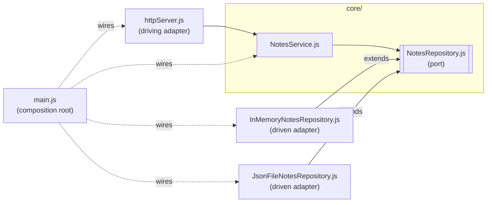

# notes-hexagonal — ports & adapters, as small as it gets

The same notes API as `../../09._Layered_architecture_hands_on/example-node/` (same endpoints, same `curl`
commands), rebuilt as **ports & adapters**. The core owns a contract — the
**port** — and everything outside the core **adapts** to it. Same language and style as `example-node/` — plain
JavaScript, `require`, zero npm dependencies — so the only thing that's
different is the architecture.

## Run it

From this folder:

```bash
docker compose up --build
```

```bash
curl localhost:3000/notes
curl localhost:3000/notes/1
curl -X POST localhost:3000/notes \
  -H 'Content-Type: application/json' \
  -d '{"title":"hello","body":"first note"}'
```

Swap the storage adapter — no code change, just configuration read by the
composition root:

```bash
NOTES_STORE=file docker compose up --build
```

Stop with `Ctrl-C`, clean up with `docker compose down`.

## The pieces

```
src/
├── core/                              ← the hexagon
│   ├── NotesRepository.js             ← PORT: base class owned by the core
│   └── NotesService.js                ← CORE: the rules; imports only the port
├── adapters/                          ← everything outside the hexagon
│   ├── httpServer.js                  ← DRIVING adapter: HTTP → core
│   ├── InMemoryNotesRepository.js     ← DRIVEN adapter: extends the port
│   └── JsonFileNotesRepository.js     ← DRIVEN adapter: extends the port
└── main.js                            ← COMPOSITION ROOT: wires it all together
```



Every solid arrow is a `require`, and every one points **into** `core/`.

## Verify the rule

```bash
grep -rn "require(" src/core
```

The only hit is `NotesService.js` requiring `./NotesRepository`. The core
knows nothing about HTTP, files or memory. Now look at an adapter:

```bash
grep -rn "require(" src/adapters
```

Every adapter requires something from `../core/`. That's the arrow flipped compared to
`../../09._Layered_architecture_hands_on/example-node/`, where presentation imported persistence directly.

## Compared with the layered `example-node/` (Session 9)

| Question                             | example-node (layered)                  | example-hexagonal                               |
|--------------------------------------|-----------------------------------------|-------------------------------------------------|
| Who defines the storage contract?    | Nobody explicitly — it's whatever `notesRepository.js` happens to export | The core, as the `NotesRepository` base class |
| Which way does the storage import go? | presentation → persistence             | adapter → core                                  |
| Where is the storage chosen?         | a `require` line inside `server.js`     | `main.js` only                                  |
| Where does validation live?          | in the HTTP handler                     | in the core (`NotesService`)                    |

## A port in a language without interfaces

A port is an interface, and JavaScript has no `interface` keyword. So the port
is written down as a **base class** whose three methods only throw
`not implemented`. Each adapter `extends NotesRepository` and overrides all
three. That gives us two things:

- The adapter's dependency on the port shows up in its `require` — where
  `grep` can see it.
- `NotesService` refuses anything that isn't a `NotesRepository`
  (`instanceof` check in its constructor), so forgetting `extends` fails at
  start-up instead of halfway through a request.

What it *doesn't* give us: nothing checks that an adapter really overrides
every method. Forget one and you find out when it's called — the base class
throws `not implemented`. Languages with real interfaces (Kotlin, Java,
TypeScript, C#) catch that before the program runs.

## What this example does *not* do

- **No database.** The two driven adapters are memory and a JSON file — enough
  to show the swap without any extra containers.
- **No tests.** Testing the core with a fake adapter is one of the in-class
  exercises.
- **No port on the driving side.** `httpServer.js` calls `NotesService`
  directly. A stricter style would put an interface there too — the driven
  side carries the lesson.
