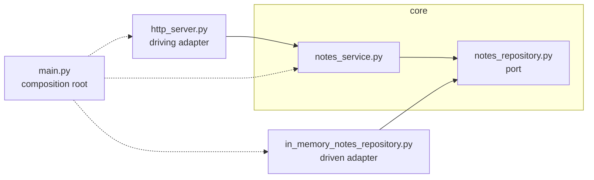

# example-python — the notes service as ports & adapters

The same notes API as Session 9's `example-node/`: same endpoints, same `curl`s. But it's built the hexagonal way, and written in Python.

## Run it

```bash
docker compose up --build
```

Then, in another terminal:

```bash
curl localhost:3000/notes
curl localhost:3000/notes/1
curl -X POST localhost:3000/notes \
  -H "Content-Type: application/json" \
  -d '{"title": "My note", "body": "Hello from curl"}'
```

Stop with `Ctrl-C`, clean up with `docker compose down`.

## Endpoints

| Method | Path          | Request body                      | Success                    | Errors |
|--------|---------------|-----------------------------------|----------------------------|--------|
| `GET`  | `/notes`      | —                                 | `200` — array of all notes | — |
| `GET`  | `/notes/:id`  | —                                 | `200` — one note           | `404` `{"error": "Note not found"}` |
| `POST` | `/notes`      | `{"title": "...", "body": "..."}` | `201` — the created note   | `400` `{"error": "title and body are required"}`, `400` `{"error": "Invalid JSON body"}` |

A note looks like `{"id": 1, "title": "Welcome", "body": "..."}`. Any other path returns `404` `{"error": "Not found"}`.

## The files

```
example-python/
├── main.py                              ← composition root
├── core/
│   ├── notes_repository.py              ← port
│   └── notes_service.py                 ← the core's own logic
└── adapters/
    ├── http_server.py                   ← driving adapter
    └── in_memory_notes_repository.py    ← driven adapter
```

| Word             | What it means                                                                 | Here |
|------------------|-------------------------------------------------------------------------------|------|
| **Core**         | The application's own logic. Knows nothing about HTTP or storage.             | `core/notes_service.py` |
| **Port**         | An interface the core defines, in its own words, for what it needs.           | `core/notes_repository.py` |
| **Driven adapter** | Implements a port. The core calls it.                                       | `adapters/in_memory_notes_repository.py` |
| **Driving adapter** | Calls the core from the outside world.                                     | `adapters/http_server.py` |
| **Composition root** | The one place that picks the adapters and plugs them in.                  | `main.py` |



Every solid arrow points **into** the core. `main.py` is the only file that knows about both sides.

## Check it yourself

```bash
grep -rn "import" core/
```

Nothing in `core/` imports anything from `adapters/`. The core never knows which adapters are plugged in.
