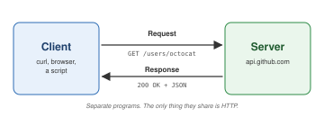
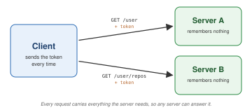
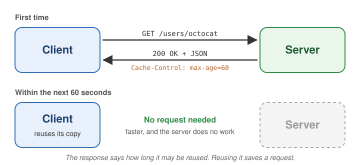
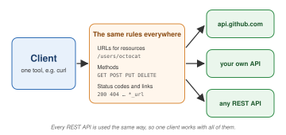
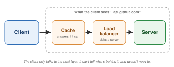

# Session 10: REST API Architecture I — Constraints, Resources, Methods

**ITA Software Architecture 2026 Fall | 3 hours**

> REST is the dominant style for web APIs, but most "REST APIs" in the wild aren't strictly RESTful — and that's fine. The point isn't purity; it's understanding the constraints REST commits to and what each one buys you. Today we'll learn that by poking at a real one: GitHub's API.

---

## Learning Goals

- Model a domain as **resources** and read URL shapes critically.
- Use HTTP methods (`GET`, `POST`, `PUT`, `PATCH`, `DELETE`) correctly, and explain *why* each behaves the way it does.
- Explain what each group of status codes means (2xx success, 3xx redirect, 4xx client error, 5xx server error), and choose the right one for a response.
- Recognise the REST constraints (uniform interface, statelessness, cacheability, …) in a real API you've just used.

---

## Before Class

Skim this README before we meet.

---

## Today's Teachings

### Part 1 — Set up: `curl` and a GitHub token (15 min)
We'll spend most of the session hitting a real API directly from the terminal. Set these up first:

1. You need `curl`. It's already on macOS and Linux, and in **Git Bash** on Windows. On Windows, use Git Bash for everything in this session, not PowerShell.
2. Create a **GitHub Personal Access Token (classic)** with read-only scopes (`public_repo`, `read:user`). Save it in an env var, e.g. `export GH_TOKEN=...`.
3. Sanity check:
   ```bash
   curl -H "Authorization: Bearer $GH_TOKEN" https://api.github.com/user | grep '"login"'
   ```
   If you see your username, you're set.

If GitHub auth is genuinely blocking you, you can do most of the session unauthed (60 requests/hour). Bring it up early so we can pair you with someone.

### The REST constraints, in short
REST is not a technology. It is a set of **constraints**: rules for how a client and a server talk to each other. Each rule takes away some freedom, and in return the system gets something useful: it can grow, be cached, and change without breaking its clients.

- **Client–server:** the client and the server are separate and only talk through requests and responses. *Why:* each side can change without the other.



- **Stateless:** every request carries everything the server needs; the server remembers nothing between requests. *Why:* any server can answer any request, so it's easy to add more servers.



- **Cacheable:** every response says whether it may be reused, and for how long. *Why:* fewer requests, faster answers.



- **Uniform interface:** every API is used the same way: resources with URLs, standard methods, status codes, and links to what comes next. *Why:* one client, like `curl`, works with any REST API.



- **Layered system:** the client can't tell whether it talks to the real server or to something in between, like a cache. *Why:* caches, load balancers and security can be added without changing the client.



Today you'll find these in GitHub's API. The part headings below say which constraint each part is about.

### Part 2 — Predict, then probe · Uniform interface: resources (15 min)
We'll look at a handful of GitHub API URLs *before* hitting them. You predict what each returns. Then we hit them and compare.

For each URL, predict: the **status code**, whether you get **one object or a list**, and **one field** you expect to see.

1. `https://api.github.com/users/octocat`
2. `https://api.github.com/users/octocat/repos`
3. `https://api.github.com/repos/torvalds/linux`
4. `https://api.github.com/users/this-user-does-not-exist-9x7`
5. `https://api.github.com/`

Then probe each one. `-i` shows the status line and headers above the body:

```bash
curl -i -H "Authorization: Bearer $GH_TOKEN" https://api.github.com/users/octocat
```

**How to build a URL.** The URLs you just probed follow a few simple rules:

- A resource is a **noun**, never a verb: `/users`, not `/getUsers`. The HTTP method is the verb.
- A **collection is plural**: `/users`, `/users/octocat/repos`.
- **One item** is the collection plus an id: `/users/octocat`, `/repos/octocat/Hello-World/issues/1`.
- **Nesting** shows "belongs to": `/users/octocat/repos` means octocat's repositories.
- A **singular** name is for something there is only one of: GitHub's `/user` means "the logged-in user", you.

### Part 3 — Break things on purpose · Uniform interface: status codes (30 min)
A scavenger hunt for status codes. You'll try requests that *should* fail and inspect what comes back. Goal: collect as many distinct status codes as you can, and figure out which method/path combinations produce them.

Some are easy. Some are sneaky (try to find a `422`).

When you find a code you don't know, look it up in MDN's [list of HTTP status codes](https://developer.mozilla.org/en-US/docs/Web/HTTP/Reference/Status).

We will collect all your findings on the blackboard.

### Part 4 — Statelessness and caching are part of the protocol (25 min)
Response headers are the API telling about itself. We'll look at `ETag`, `Cache-Control`, and the rate-limit headers — and use conditional requests (`If-None-Match`) to make calls that *don't count against your rate limit*.

- `ETag`: a fingerprint of the response. If the data changes, the `ETag` changes.
- `Cache-Control`: how long the response may be reused before asking again. GitHub sends `max-age=60`, which means 60 seconds.
- `X-RateLimit-Limit`, `X-RateLimit-Remaining`, `X-RateLimit-Reset`: how many requests you get per hour, how many you have left, and when the count starts over.
- `If-None-Match`: a header *you* send, containing the `ETag` you got last time. If nothing has changed, GitHub answers `304 Not Modified` with no body, and the request doesn't count against your rate limit.

### Part 5 — Follow the links · Uniform interface: hypermedia (HATEOAS) (20 min)
**HATEOAS** ("Hypermedia As The Engine Of Application State") is one of the REST ideas: an API response should contain links to what you can do or see next, just as a web page does. In theory, a client only needs to know one starting address and can find everything else by following links.

Look at a single repository response, for example `https://api.github.com/repos/octocat/Hello-World`. Count the `*_url` fields. We'll try to navigate from a user to a specific issue without typing a single URL — only by following links inside responses. Then we'll talk about why almost no real client actually does this.

Start here and follow the trail:

1. `https://api.github.com/users/octocat`: find `repos_url` and follow it.
2. In the list of repositories, find `Hello-World` and follow its `url`.
3. In the repository, find `issues_url`: `https://api.github.com/repos/octocat/Hello-World/issues{/number}`. The `{/number}` part is a template you fill in yourself. Use issue `1`.
4. In the issue, follow `comments_url`.

Look at step 3: is filling in a template still "following a link"?

### Part 6 — API archaeology (45 min, in pairs)
Each pair picks one mystery and investigates it: what URI shape, what method, what status codes, what surprised you. Examples:

- Star a repo, then unstar it. What methods? What status codes?
- Create an issue, edit it, close it. Follow the full lifecycle.
- Find every way GitHub returns `422`.
- What's the difference between `/user` and `/users`?
- Page through a user's repositories. How does the API tell you there's a next page?

### Part 7 — What we just learned · The REST constraints (30 min)
Where we saw each constraint today:

- **Client–server:** `curl` and GitHub share nothing but HTTP. Any client (`curl`, a browser, a script) talks to the server the same way.
- **Statelessness:** every request carries everything the server needs, including your token. GitHub doesn't remember you between calls (Parts 1 and 4).
- **Cacheability:** responses say whether and for how long they may be reused (`Cache-Control`, `ETag`), and a `304` saves both data and rate limit (Part 4).
- **Uniform interface:** the same few rules everywhere: resources with URLs, the same methods, the same status codes, and links to what comes next (Parts 2, 3 and 5).
- **Layered system:** you can't tell whether you're talking to GitHub's own servers or to something in front of them, like a cache, and you don't need to.

---

## Exercise

Sketch a REST API for a small domain you care about (a library, a recipe book, a habit tracker, anything). Just URLs + methods + status codes — no implementation. Bring it to session 11, where we'll do versioning, pagination, and error shapes on top of it.

---

## Investigation (after class)

You learned the REST constraints by poking at a real API. Now sharpen what you noticed by interrogating an LLM about it — and verifying.

**Ground rule:** the LLM is a fast, confident, sometimes-wrong study partner. For every claim it makes that matters, verify it against the real API (a `curl` away) or the [GitHub docs](https://docs.github.com/en/rest). The point isn't to collect answers; it's to learn to *check* them.

Pick **three** of the four prompts below. For each:

1. Run the prompt in Mistral Vibe (or another LLM tool — Vibe works well because it can also run the verification command for you).
2. Verify the central claim with a real request or a doc lookup.
3. Note one place the LLM was correct, one place it was vague, wrong, or hedged.

### Prompt 1 — Why does GitHub return 404 when 403 would be more honest?
> "When I ask GitHub's API for a private repo I don't have access to, it returns 404 Not Found instead of 403 Forbidden. Why? Is this REST-compliant?"

**Verify:** create a private repo on your own account, then try to fetch it both with and without your token. Then try fetching `/repos/some-real-org/some-real-private-repo`. Compare the status codes and the response bodies.

### Prompt 2 — Star a repo: idempotent or not?
> "Show me the exact HTTP requests to star and unstar a GitHub repo. Which HTTP method does each use, and is the operation idempotent in the REST sense? What status codes should I expect?"

**Verify:** actually star and unstar a repo (use a test repo or one of your own). Run the calls twice in a row each. Does the second call behave the same as the first? Does the status code change? Does the LLM's answer match what you observe?

### Prompt 3 — `If-None-Match` and the rate limit
> "On GitHub's API, if I send a conditional GET with `If-None-Match` and the server responds 304, does that request count against my rate limit? Cite a primary source."

**Verify:** make 5 unauth'd requests to the same endpoint, capture the `X-RateLimit-Remaining` value each time. Then make 5 more using `If-None-Match` with the ETag from the first response. Compare. Read the relevant section of GitHub's rate-limit docs and check whether the LLM's claim matches.

### Prompt 4 — REST cheating
> "GitHub's API returns 405 Method Not Allowed when I try `DELETE /repos/{owner}/{name}/issues/{n}`. Why don't they let me delete issues via the API? Is this a REST violation, and if so, why is it the right call here?"

**Verify:** try the delete (it'll fail safely with 405). Read GitHub's issues API docs. Cross-check the LLM's reasoning against what GitHub actually documents about issue lifecycle.

---

## Optional

- [optional] Fielding, R. — *Architectural Styles and the Design of Network-based Software Architectures*, dissertation chapter 5 (2000). The primary source for REST. Dense; the investigation above covers the working knowledge.
- [optional] Tilkov, S. — *REST APIs must be hypertext-driven* (Fielding's blog rant on REST purity).
- [optional] GitHub REST API docs: <https://docs.github.com/en/rest>. Useful when verifying in the investigation kit; also a great browse if you want more.
