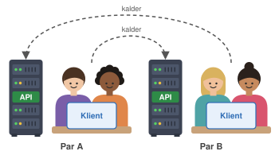
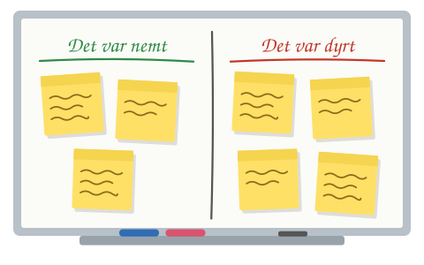

# Session 11: Når andre afhænger af dit API

**ITA Software Architecture 2026 Fall**

> I dag bygger I ikke et API. I lader andre bruge det i allerede har lavet, og så ændrer I det, og ser hvad der sker.
> Det er her, i finder ud af, hvad et API egentlig lover.

---

## Dagens spørgsmål

**AI kan ændre et API på 30 sekunder. Hvorfor betragtes det så stadig som dyrt at ændre et API?**

Det kan I svare på, når I går hjem. Ikke fordi I har læst svaret, men fordi I har prøvet det.

---

## Læringsmål

Efter i dag kan du:

- forklare, hvad en **API-kontrakt** er, og hvorfor den er en arkitekturbeslutning
- skelne mellem en **breaking** og en **non-breaking** ændring
- ændre et API uden at ødelægge dem, der bruger det (versionering, *tilføj, men fjern aldrig*)
- vurdere, om et API's **fejlsvar** er til at bruge for en klient

---

## Før timen

- Hav jeres **notes-service fra session 9** klar og kørende (`docker compose up`). Det er jeres API i dag. Hvis jeres version ikke virker, så brug eksemplet i [`09._Layered_architecture_hands_on/example-node`](../09._Layered_architecture_hands_on/example-node). Gem denne applikation i en mappe på din computer, og kør den med kommandoen `docker compose up --build`.
- Sørg for, at jeres version ligger på **GitHub**, og at repoet er offentligt eller delt med holdet.
  - Sådan gør I (som i [session 2](../02._terminal_linux_git/README.md)): Opret et nyt, tomt repo på github.com under jeres egen konto, og vælg **Public**. Klon det, kopiér jeres notes-service ind i mappen, og push:

    ```bash
    git clone <url-til-jeres-repo>
    cd <jeres-repo>
    # kopiér filerne fra jeres notes-service herind
    git add .
    git commit -m "Notes-service"
    git push
    ```

    Vil I hellere have et privat repo, så giv det andet par adgang under **Settings → Collaborators → Add people**.
- Hav jeres AI-agent klar. I må bruge den til alt i dag.
- Installér **Insomnia** fra <https://insomnia.rest/download> (hvis I ikke allerede har den installeret fra 1. semester).

---

## Demo · Insomnia i stedet for curl (10 min)

**I dag bruger vi Insomnia i stedet for `curl`.** Det er det samme: I sender en HTTP-request og ser svaret. Men i Insomnia ser I statuskode, headers og JSON på én gang, og I kan gemme jeres requests og sende dem igen.

Kort demo - GitHubs API, som I kender fra [session 10](../10._rest_api_architecture_1/README.md):

1. **Hent en ressource:** `GET https://api.github.com/users/Ek-Ita-Swa-Iti`. Se statuskoden (`200 OK`), JSON-svaret og fanen med headers. Find `x-ratelimit-remaining`.
2. **Noget, der ikke findes:** `GET https://api.github.com/users/<et-navn-der-ikke-findes>`. Nu får I `404 Not Found` og et JSON-svar med en `message`.
3. **Fra curl til Insomnia:** Indsæt en `curl`-kommando i URL-feltet, fx `curl https://api.github.com/users/Ek-Ita-Swa-Iti/repos`. Insomnia laver den om til en request.

---

## Sådan er I sat sammen



I arbejder i **par**, og to par danner en **gruppe**. Hvert par har to roller på samme tid:

- **API-ejer:** I ejer jeres egen notes-service.
- **Klient:** I bygger noget, der bruger det andet pars API.

Par A bruger Par B's API, og Par B bruger Par A's.

**Én regel gælder hele dagen: Som klient må I ikke åbne det andet pars kode.** I må bruge Insomnia, prøve jer frem og spørge ejerne. Præcis som hvis API'et tilhørte en anden virksomhed.

---

## Del 1: Demo · Det tog 30 sekunder (15 min)

Vi starter med en kort demo af hvad der er jeres øvelse går ud på

Så kommer en ny udvikler ind og synes, at feltet `body` er et dårligt navn. Underviseren beder AI'en omdøbe det til `content`. Det tager et halvt minut, koden er pæn, og servicens egen frontend er også opdateret.

Så kører klient-scriptet igen.

**Diskutér i plenum:**
- Hvad gik galt? Var ændringen forkert?
- Hvem opdagede fejlen, og hvornår?
- Hvad ville det koste, hvis klienten var en app på 10.000 telefoner?

---

## Del 2: Øvelse · Byg en klient mod et fremmed API (35 min)

**Opgave:** Byg en lille klient til det andet pars notes-API. Den skal kunne:

1. vise alle noter
2. vise én note ud fra dens id
3. oprette en ny note

Formen er valgfri: et script i Node, en simpel HTML-side eller en samling requests i Insomnia. Brug gerne AI til at bygge den.

**Sådan får I API'et til at køre hos jer:**

```bash
git clone <det-andet-pars-repo>
cd <repo>/example-node        # eller hvor deres docker-compose.yml ligger
docker compose up
```

Kør deres API på jeres egen maskine. Kig ikke i koden, kun i `docker compose`-outputtet.

> Kan I nå hinanden over netværket (session 4), må I også kalde hinandens maskiner direkte. Men klassens wifi blokerer det tit, så `git clone` er planen.

**Mens I arbejder, skal I føre en spørgeliste.** Skriv hver eneste ting ned, som I skulle gætte eller spørge ejerne om. For eksempel: *Hvad hedder felterne? Er id et tal eller en tekst? Hvad sker der, hvis titlen mangler?*

Som API-ejere skal I svare, når det andet par spørger. Skriv også ned, hvad I blev spurgt om.

---

## Del 3: Opsamling · Spørgelisten er kontrakten (15 min)

Hver gruppe læser sin spørgeliste op. vi samler alle spørgsmål på tavlen.

Alt det, der står på tavlen, er det, en klient skal vide for at kunne bruge et API uden at ringe til dem, der har lavet det. Det hedder en **kontrakt**. Den findes altid, men ofte kun i hovedet på den, der har skrevet koden.

**Snak:** Hvilke spørgsmål handlede om det, der virker (felter, URL'er, metoder), og hvilke handlede om det, der går galt (fejl, manglende data)?

---

## Pause

---

## Del 4: Øvelse · Kunden har et ønske (35 min)

Hvert par trækker et **forandringskort** fra underviseren. Kortet er et krav fra kunden, som I skal lave i jeres API. Eksempler:

| # | Kundens ønske |
|:-:|---|
| 1 | "Feltet `body` skal hedde `content`. Det er det, vi kalder det i forretningen." |
| 2 | "Noter skal kunne have tags." |
| 3 | "Listen over noter er for lang. Vi vil have sider med 10 noter ad gangen." |
| 4 | "Id'er skal være UUID'er i stedet for tal. Det kræver vores nye database." |
| 5 | "Det skal være tilladt at oprette en note uden `body`." |
| 6 | "Fejlbeskeder skal have et fast format med en fejlkode, så vi kan oversætte dem." |
| 7 | "Hver note skal vise, hvornår den er oprettet." |
| 8 | "Man skal kunne slette noter." |

**Gang i den:**

1. **Forudsig først (5 min).** Før I rører koden: Vil ændringen ødelægge det andet pars klient? Skriv jeres gæt ned.
2. **Lav ændringen (15 min).** Brug AI. Push til GitHub.
3. **Sandhedens øjeblik (5 min).** Det andet par kører `git pull`, genstarter jeres API og kører deres klient. Virker den stadig?
4. **Hvis den gik i stykker (10 min).** Find en måde at levere kundens ønske på *uden* at ødelægge klienten. Nogle muligheder:
   - **Tilføj, fjern ikke:** send både `body` og `content` i en periode
   - **Ny version:** lad `/v1/` blive, som den er, og lav ændringen i `/v2/`
   - **Gør det valgfrit:** nye felter og parametre har en standardværdi

Skriv på jeres kort: **breaking eller non-breaking?** Og hvordan ville I levere den i virkeligheden?

---

## Del 5: Fejljagt · Kan man bruge jeres fejl til noget? (15 min)

Som klient: Prøv at ødelægge det andet pars API. Send

- en note uden titel
- ugyldig JSON
- et id, der ikke findes
- et id, der ikke er et tal
- en URL, der ikke findes
- en metode, API'et ikke kender (fx `DELETE`, hvis de ikke har lavet det)

For hvert svar: **Hvilken statuskode fik I? Kunne jeres klient gøre noget fornuftigt med svaret?** Eller skulle I bare vise "Noget gik galt"?

Giv det andet par jeres tre bedste fund.

**Som API-ejere:** Ændr jeres API, så det løser de fundne problemer. Læg mærke til, om ændringen ødelægger jeres API for det andet pars klient (**breaking** eller **non-breaking**).

---

## Del 6: Afrunding · Hvad var dyrt? (15 min)

På tavlen laver vi to kolonner:



Hver gruppe sætter post-its op ud fra dagens oplevelser.

Tilbage til dagens spørgsmål: **AI kan ændre et API på 30 sekunder. Hvorfor er det så stadig dyrt?** Passer jeres oplevelse med det? Eller var ændringerne i virkeligheden nemme hele vejen igennem?

---

## Hvis du vil vide mere

- [valgfrit] Zalando, [*RESTful API Guidelines*](https://opensource.zalando.com/restful-api-guidelines/). Læs [afsnittene om versionering og kompatibilitet](https://opensource.zalando.com/restful-api-guidelines/#compatibility).
