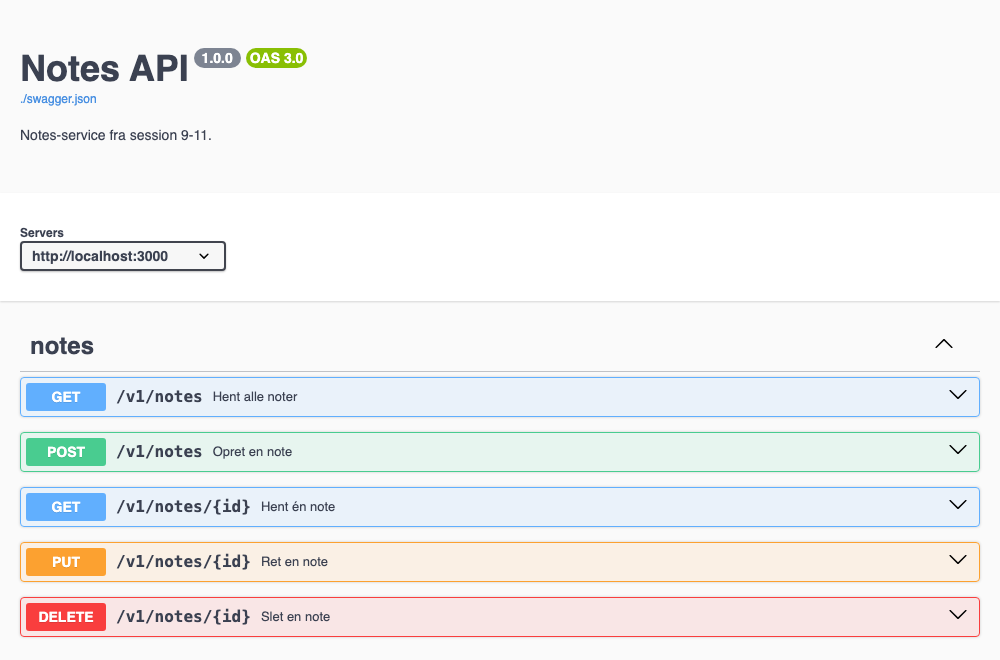

# Session 12: Skriv kontrakten ned · OpenAPI

**ITA Software Architecture 2026 Fall**

> Vi bygger videre på [session 11](../11._rest_api_architecture_2/README.md): samme par, samme notes-service.
>
> Sidst skrev I en spørgeliste over alt det, I skulle gætte jer til eller spørge ejerne om for at bruge det andet pars API. Den liste er kontrakten, men indtil nu har den kun fandtes på papir og i hovedet på dem, der skrev koden. I dag bruger I den til at skrive kontrakten ned som en OpenAPI-specifikation.

---

## Læringsmål

Efter i dag kan du:

- skrive en kontrakt ned som en **OpenAPI-specifikation** og tjekke, om den passer med virkeligheden

---

## Før timen

- Hav jeres **notes-service** fra session 11 klar og kørende (`docker compose up`).
- Tag jeres **spørgeliste** fra session 11 med.
- Hent Swagger UI på forhånd, så vi ikke venter på downloads: `docker pull swaggerapi/swagger-ui`

---

## Del 1: Øvelse · Skriv kontrakten ned (30 min)

**Som API-ejere:** Skriv eller generér en **OpenAPI-specifikation** (`swagger.json`) for jeres eget API. Brug AI'en til første udkast. Den skal dække:

- alle endpoints, med metoder og felter
- mindst **ét fejlsvar** pr. endpoint, ikke kun det, der går godt
- en **version** i stien, fx `/v1/notes` (skal I så ændre koden? Beslut det selv)
- en `servers`-linje, der peger på jeres API: `"servers": [{ "url": "http://localhost:3000" }]`

<hr>



**Se jeres specifikation som dokumentation.** Til det bruger I **Swagger UI**, et værktøj der læser `swagger.json` og viser den som klikbar dokumentation over alle jeres endpoints. I kører det lokalt i Docker, ved siden af jeres API. Læg `swagger.json` i en mappe `spec/` ved siden af `docker-compose.yml`, og tilføj Swagger UI som en service i `docker-compose.yml`:

<br clear="right">

<hr>

```
notes-service/
├── backend/
│   ├── Dockerfile
│   └── src/
├── frontend/
├── spec/
│   └── swagger.json      ← ny
└── docker-compose.yml
```

```yaml
  swagger-ui:
    image: swaggerapi/swagger-ui
    ports:
      - "8081:8080"
    environment:
      SWAGGER_JSON: /spec/swagger.json
    volumes:
      - ./spec:/spec:ro
```

Kør `docker compose up`, og åbn <http://localhost:8081>. Når I retter i `spec/swagger.json`, skal I bare genindlæse siden.

> Virker Docker ikke, kan I i stedet indsætte indholdet af `swagger.json` i **Swagger Editor** på <https://editor.swagger.io/>. Den viser den samme dokumentation i højre side.

**Byt og tjek.** Giv jeres `swagger.json` til det andet par. Som klient skal I nu teste den mod virkeligheden med **Insomnia**. I kan importere `swagger.json` direkte i Insomnia, så har I alle requests klar:

- Passer felterne?
- Er statuskoderne, som specifikationen siger?
- Kan I finde **mindst én uoverensstemmelse** mellem specifikationen og det, API'et faktisk gør?

AI'en skrev specifikationen hurtigt. Men har den ret? Og hvem opdager det, hvis den tager fejl?

---

## Del 2: Sådan gør de andre

Demo: GitHubs egen OpenAPI-specifikation af api.github.com, det API I brugte i session 10 og 11: [`api.github.com.json`](https://github.com/github/rest-api-description/blob/main/descriptions/api.github.com/api.github.com.json).

Flere kendte API'er, der offentliggør deres OpenAPI-specifikation:

- **DMI** (vejrdata): DMI's API til vejrobservationer kører live i Swagger UI, ligesom jeres egen: <https://opendataapi.dmi.dk/v2/metObs/api>
- **Discord**: [`discord/discord-api-spec`](https://github.com/discord/discord-api-spec/blob/main/specs/openapi.json)
- **OpenAI** (API'et bag ChatGPT): [`openai/openai-openapi`](https://github.com/openai/openai-openapi/blob/main/openapi.yaml)
- **Mistral AI** (europæisk AI, bag Le Chat): [`openapi.yaml`](https://docs.mistral.ai/openapi.yaml)

---

## Efter timen

Gem `swagger.json`. I skal bruge den i projektet (session 14-17).
