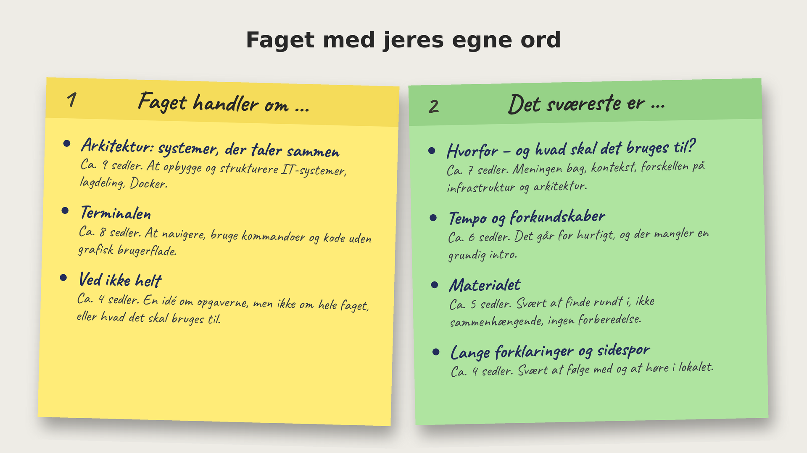
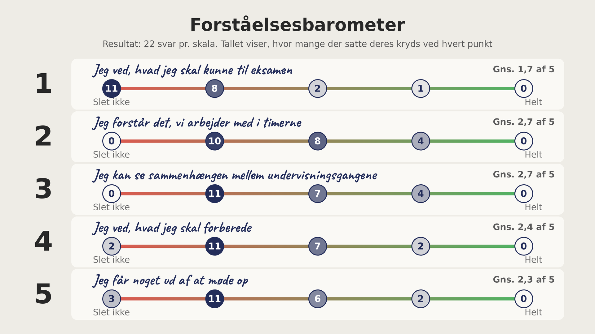
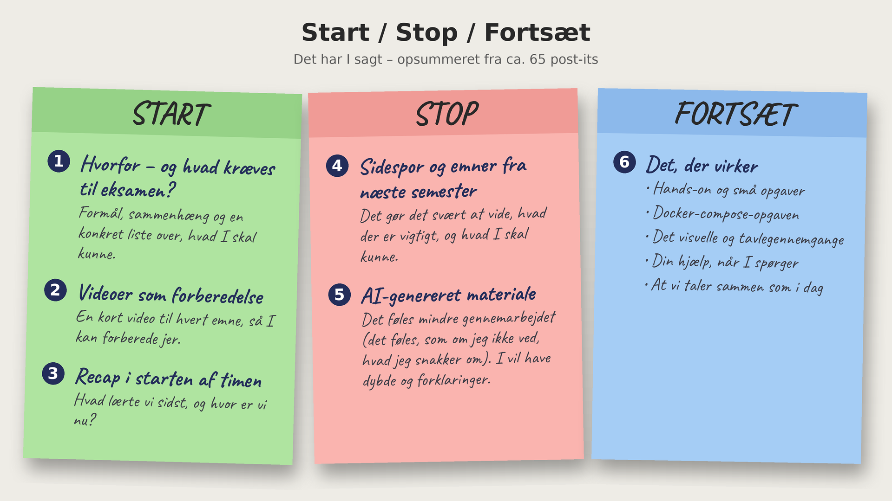

# Evalueringer

Resultaterne af de tre [evalueringer fra session 11](../11._rest_api_architecture_2/evalueringer.md).

## Faget med jeres egne ord

## Forståelsesbarometer

## Start / Stop / Fortsæt

